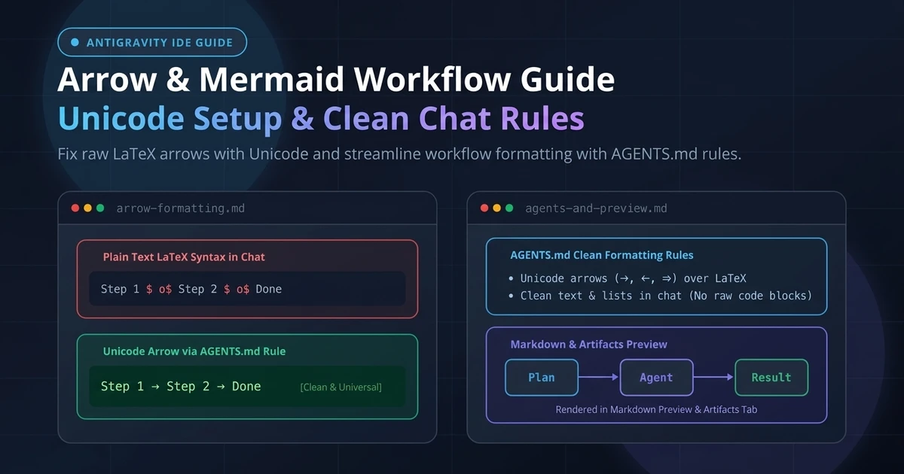
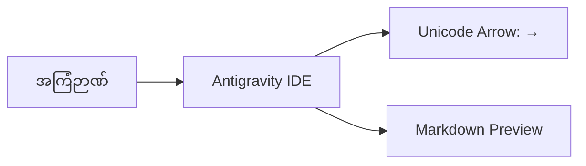

Google Antigravity IDE နဲ့ AI Pair Programming လုပ်ရင်း Chat ထဲမှာဖြစ်စေ၊ Markdown Note တွေ ဖတ်ရင်းနဲ့ဖြစ်စေ မျှားပုံစံ မထွက်ဘဲ `$\to$` သို့မဟုတ် `$\longrightarrow$` ဆိုပြီး စာသားအကြမ်းကြီး ပေါ်နေတာကို ကြုံဖူးကြမှာပါ။

အဲဒီအပြင် AI Agent ကို Architecture သို့မဟုတ် Workflow တွေ ရှင်းပြခိုင်းတဲ့အခါ Chat ထဲမှာ မျက်စိနဲ့ ချက်ချင်း မြင်သာတဲ့ Diagram အဖြစ် မထွက်ဘဲ Mermaid Code Block အကြမ်းကြီးအတိုင်း ပေါ်လာတာမျိုးလည်း ရှိပါတယ်။

ဒီဆောင်းပါးမှာတော့ ဒီပြဿနာတွေ ဘာကြောင့် ဖြစ်ရတာလဲဆိုတဲ့ အကြောင်းရင်းအမှန်နဲ့ မျက်စိအေးအေးနဲ့ အဆင်ပြေပြေ အလုပ်လုပ်နိုင်အောင် ဘယ်လို စနစ်တကျ ပြင်ဆင်ရမလဲဆိုတာကို အသေးစိတ် ရှင်းပြပေးသွားပါမယ်။



---

## ၁။ Arrow (`$\to$`) က ဘာကြောင့် Plain Text အဖြစ် ပေါ်နေတာလဲ

အဓိက အကြောင်းရင်းကတော့ Markdown Parser တွေရဲ့ သဘောသဘာဝကြောင့် ဖြစ်ပါတယ်။

1. **LaTeX Math vs Standard Markdown:** သင်္ချာဖော်မြူလာတွေ ရေးတဲ့ LaTeX မှာ မျှားပြဖို့ `\to` ဒါမှမဟုတ် `\longrightarrow` ကို ဒေါ်လာသင်္ကေတ `$...$` ကြားထဲ ထည့်ရေးကြပါတယ်။
2. **Chat Window ထဲမှာ Math Parser မပါဝင်ခြင်း:** Antigravity IDE (နဲ့ VS Code) ရဲ့ Chat Panel ဟာ သာမန် Markdown ကိုပဲ Render လုပ်ပေးတာ ဖြစ်ပြီး Chat စာသားတွေအပေါ်မှာ KaTeX/LaTeX Math Engine ကို မောင်းနှင်မပေးပါဘူး။
3. **AI က LaTeX အကျင့်ပါနေခြင်း:** AI Agent တွေဟာ သင်္ချာနဲ့ သိပ္ပံစာတမ်းတွေကို လေ့လာထားတာများတဲ့အတွက် အဆင့်တွေကို ရှင်းပြတဲ့အခါ `Step 1 $\to$ Step 2` ဆိုပြီး အလိုလို ရေးချမိတတ်ပါတယ်။

### အကောင်းဆုံး ဖြေရှင်းနည်း

ဒေါ်လာသင်္ကေတနဲ့ LaTeX ပုံစံ ရေးမယ့်အစား လူသုံးများပြီး နေရာတိုင်းမှာ အမှန်တကယ် ပေါ်တဲ့ **Standard Unicode Arrow (`→`, `←`, `↔`, `⇒`)** တွေကို တိုက်ရိုက် သုံးခိုင်းတာ အကောင်းဆုံး ဖြစ်ပါတယ်။

---

## ၂။ Mermaid Diagram နဲ့ Antigravity Chat ရဲ့ လက်တွေ့ အခြေအနေ

လူတော်တော်များများ ထင်ထားသလို Antigravity Chat Panel ဟာ Chat Bubble ထဲမှာ Mermaid Code တွေကို Diagram အဖြစ် တိုက်ရိုက် Render မလုပ်ပေးနိုင်ပါဘူး (Security နဲ့ Performance ကြောင့် VS Code Chat တွေမှာ Code Block အဖြစ်ပဲ ပြပေးတာ ဖြစ်ပါတယ်)။

အင်တာနက်ပေါ်မှာ တွေ့ရတတ်တဲ့ `"mermaid-chat.enabled": true` ဆိုတာမျိုးဟာ တကယ်မရှိတဲ့ Setting အတု (Hallucination) သာ ဖြစ်ပါတယ်။

Mermaid Diagram ကို အမှန်တကယ် ပုံစံကျကျ ကြည့်ရှုနိုင်တဲ့ နေရာတွေကတော့-

| နေရာ | အလုပ်လုပ်ပုံ | အသုံးပြုနည်း |
| :--- | :--- | :--- |
| **Markdown Preview** (`Ctrl+Shift+V`) | `.md` ဖိုင်တွေထဲက Mermaid Code တွေကို Graphic Diagram အဖြစ် လှလှပပ Render လုပ်ပေးတယ်။ | VS Code Built-in သို့မဟုတ် `bierner.markdown-mermaid` Extension |
| **Agent Artifacts Tab** | Agent က ထုတ်ပေးတဲ့ `.md` Artifact ဖိုင်တွေကို Preview Tab အနေနဲ့ ဖွင့်ပြတဲ့အခါ Diagram အဖြစ် မြင်တွေ့နိုင်တယ်။ | Antigravity ရဲ့ Built-in Preview စနစ် |
| **Chat Panel** | Chat ထဲမှာတော့ Mermaid Code တွေကို Raw Text အဖြစ်ပဲ ပြပေးနိုင်တယ်။ | Chat ထဲမှာ Diagram အစား Unicode Arrow နဲ့ List တွေ သုံးခိုင်းတာ အသင့်တော်ဆုံး |

ဒါကြောင့် Chat ထဲမှာ မလိုအပ်ဘဲ ရှည်လျားတဲ့ Mermaid Code အကြမ်းကြီးတွေ မပေါ်လာစေဖို့နဲ့ Markdown File တွေထဲမှာပဲ သပ်သပ်ရပ်ရပ် သုံးဖို့ AI ကို လမ်းညွှန်ပေးရပါမယ်။

---

## ၃။ အဆင့်ဆင့် လက်တွေ့ ပြင်ဆင်နည်း

ဒီအဆင့်တွေကို သတ်မှတ်ပေးလိုက်တာနဲ့ Chat ထဲမှာ `$\to$` ပျောက်သွားပြီး အမြင်ရှင်းတဲ့ Workflow တွေကို ချက်ချင်း ရရှိမှာပါ-

### အဆင့် (၁) - Workspace Rule (`AGENTS.md`) သတ်မှတ်ပါ

AI Agent ကို Chat ထဲ စကားပြောတိုင်း `$\to$` မသုံးဘဲ သန့်ရှင်းတဲ့ Unicode `→` ပဲ သုံးဖို့နဲ့ Chat ထဲမှာ မလိုအပ်တဲ့ Mermaid Code အကြမ်းကြီးတွေ မထုတ်ဖို့အတွက် Project ရဲ့ Root မှာ `AGENTS.md` ဖိုင်တစ်ခု ဆောက်ပေးရပါမယ်။

သင့် Workspace Folder ရဲ့ ထိပ်ဆုံးမှာ `AGENTS.md` ဖိုင်ဆောက်ပြီး အောက်ပါ Rule တွေကို ထည့်သွင်းပေးပါ-

```markdown
# Repository Guidance

## Symbols & Arrow Guidelines

- **Unicode Over LaTeX for Arrows & Symbols:** Always use standard Unicode arrows (`→`, `←`, `↔`, `⇒`) instead of LaTeX math syntax (`$\to$`, `$\longrightarrow$`, `\implies`, `$$\text{...}$$`). Antigravity chat and markdown previews do not run KaTeX/LaTeX parsers on regular text, causing raw LaTeX commands to render as unsightly plain text.
- **Math & Dimensions:** Use Unicode symbols for dimensions and math operators (e.g. `512 × 512 px` instead of `$512 \times 512$`).
- **No Raw Mermaid in Chat:** Do not output raw Mermaid code blocks in chat conversations since the chat interface does not render them visually. Use clean Unicode arrows, lists, or structured text instead.
```

> [!TIP]
> Antigravity ဟာ စည်းမျဉ်း (Rules) တွေကို Project Root က `AGENTS.md` (သို့မဟုတ် `.agents/`) နဲ့ Global အနေနဲ့ `~/.gemini/config/rules/` တွေကနေ အလိုအလျောက် ဖတ်ရှုပါတယ်။ ဒါကြောင့် ဖိုင်လမ်းကြောင်း မှန်ကန်အောင် ထားပေးဖို့ အရေးကြီးပါတယ်။

---

### အဆင့် (၂) - Markdown ဖိုင်တွေအတွက် Mermaid Preview စစ်ဆေးပါ

Markdown ဖိုင်တွေထဲမှာ ရေးထားတဲ့ Mermaid Diagram တွေကို ပုံစံတကျ ကြည့်ရှုနိုင်ဖို့ Antigravity IDE ရဲ့ Extensions ထဲမှာ `bierner.markdown-mermaid` Extension ရှိမရှိ စစ်ဆေးပြီး လိုအပ်ရင် Install လုပ်ထားပေးနိုင်ပါတယ်။

`settings.json` ထဲမှာ Dark Mode အရောင်အသွေး သတ်မှတ်ချင်ရင်တော့ အောက်ပါအတိုင်း ထည့်ပေးနိုင်ပါတယ်-

```json
{
  "markdown-mermaid.darkModeTheme": "dark",
  "markdown-mermaid.lightModeTheme": "default"
}
```

---

## ၄။ အမှန်တကယ် အလုပ်လုပ်မလုပ် စမ်းသပ်ကြည့်နည်း

ပြင်ဆင်ပြီးသွားရင် အောက်ပါအတိုင်း စမ်းသပ်ကြည့်နိုင်ပါတယ်-

### က။ Arrow စမ်းသပ်ခြင်း

AI Chat ထဲမှာ `Show me a 3-step workflow` လို့ ရေးမေးကြည့်ပါ။ အရင်လို `$\to$` မထွက်တော့သလို Mermaid Code အကြမ်းကြီးတွေလည်း မရှုပ်တော့ဘဲ အောက်ပါအတိုင်း သန့်သန့်ရှင်းရှင်း ပေါ်လာပါမယ်-

> Planning → Implementation → Verification

### ခ။ Mermaid Markdown Preview စမ်းသပ်ခြင်း

Markdown ဖိုင်တစ်ခုထဲမှာ အောက်ပါ Code Block ကို ထည့်ပြီး `Ctrl+Shift+V` နှိပ်ကာ Preview ဖွင့်ကြည့်ပါ-



Markdown Preview ထဲမှာ သပ်ရပ်လှပတဲ့ Interactive Flowchart အဖြစ် ချက်ချင်း ပြသပေးတာကို တွေ့ရပါလိမ့်မယ်။

---

## အနှစ်ချုပ်

Antigravity IDE မှာ Arrow တွေ `$\to$` ပေါ်နေတာနဲ့ Mermaid Code တွေ မထွက်တာဟာ Chat UI ရဲ့ သဘာဝကြောင့် ဖြစ်ပါတယ်။

1. **Arrow အတွက်:** LaTeX `$\to$` အစား Unicode `→` သုံးဖို့ `AGENTS.md` ထဲမှာ သတ်မှတ်ပေးပါ။
2. **Mermaid အတွက်:** Chat ထဲမှာ Code အကြမ်းတွေ မထုတ်ခိုင်းဘဲ Markdown Preview (`Ctrl+Shift+V`) နဲ့ Artifacts တွေမှာပဲ အသုံးပြုပါ။

ဒီနည်းလမ်းအတိုင်း ပြင်ဆင်ထားရင် Coding လုပ်တဲ့အခါ မျက်စိအေးပြီး ပိုမို ရှင်းလင်းတဲ့ AI Pair Programming အတွေ့အကြုံကို ရရှိမှာ သေချာပါတယ်။
