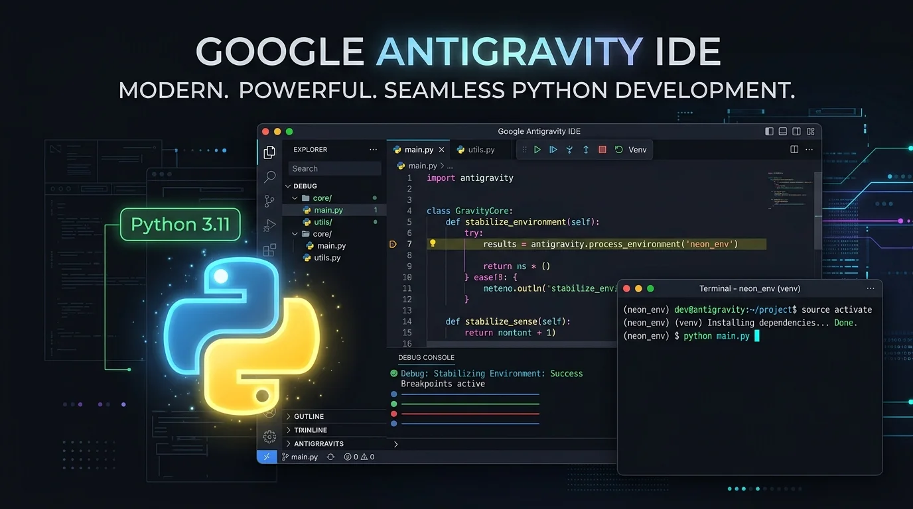
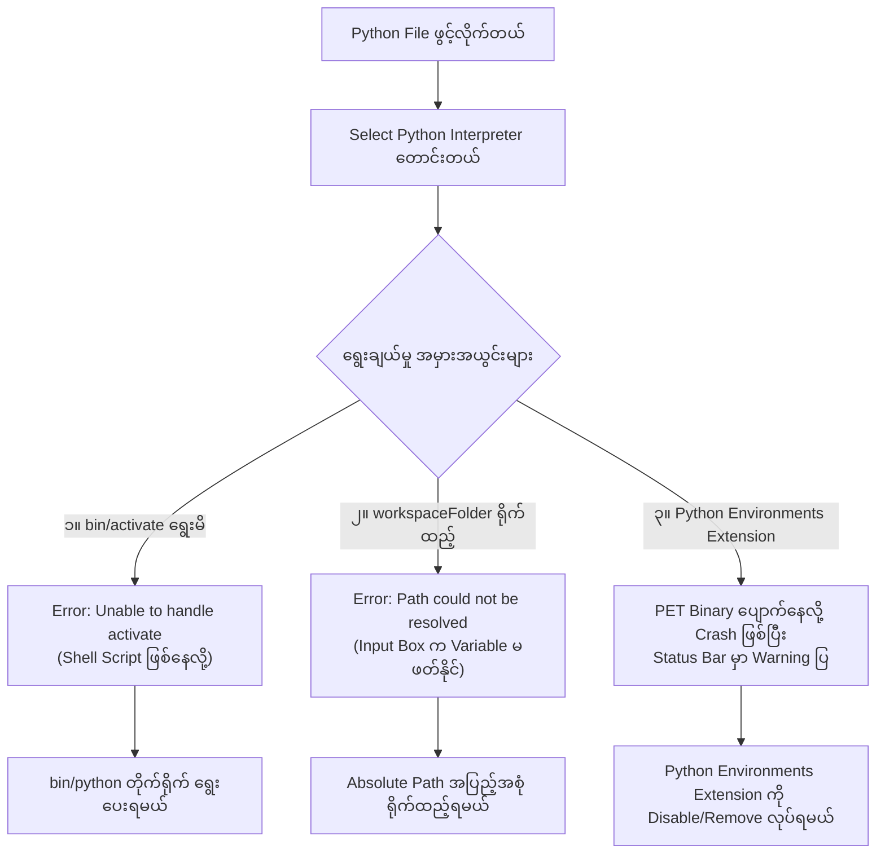

Google Antigravity IDE (VS Code အပေါ် အခြေခံထားတဲ့ AI-first IDE) မှာ Python Project တွေ ရေးတဲ့အခါ Interpreter ရွေးမရတာ၊ Error တက်တာနဲ့ Status Bar မှာ Warning အရောင်ပြပြီး ရပ်နေတဲ့ ပြဿနာတွေကို ကြုံဖူးကြမှာပါ။

ဒီနေ့မှာတော့ ကျွန်တော် ကိုယ်တိုင် Project တစ်ခုမှာ Virtual Environment ချိတ်ဆက်ရင်း ကြုံတွေ့ခဲ့ရတဲ့ Error ၃ ခု၊ အဲဒီ Error တွေရဲ့ နောက်ကွယ်က တကယ့် Root Cause တွေနဲ့ အပြီးသတ် အဆင်ပြေသွားအောင် ဘယ်လို ဖြေရှင်းခဲ့သလဲဆိုတာကို အသေးစိတ် ပြန်လည် မျှဝေပေးသွားပါမယ်။



---

## ၁။ ကြုံတွေ့ခဲ့ရတဲ့ ပြဿနာ ၃ ခု

ကျွန်တော်တို့ Python Project တစ်ခုကို ဖွင့်လိုက်တဲ့အခါ IDE က Language Server နဲ့ Autocomplete တွေအတွက် Python Interpreter ရွေးခိုင်းပါတယ်။ အဲဒီအခါ အောက်ပါ ပြဿနာတွေ တစ်ခုပြီးတစ်ခု တက်လာခဲ့ပါတယ်-

1. **`bin/activate` ကို Interpreter အဖြစ် ရွေးမိခြင်း:**
   ```text
   Unable to handle /home/hhk/Projects/.../.venv/bin/activate
   ```
2. **`${workspaceFolder}` Path ကို ရှာမတွေ့ခြင်း:**
   ```text
   Default interpreter path '${workspaceFolder}/.venv/bin/python' could not be resolved
   ```
3. **Status Bar မှာ "Select Python Interpreter" ၂ ခု ထပ်နေပြီး တစ်ခုက Warning ပြနေခြင်း:**
   - တစ်ခုက ပုံမှန် အလုပ်လုပ်နေပေမဲ့ နောက်တစ်ခုက Warning အရောင် (ဝါကျင့်ကျင့်/လိမ္မော်ရောင်) ပြနေပြီး နှိပ်လည်း ရွေးမရ၊ Activate လည်း လုပ်မရ ဖြစ်နေတာပါ။

ဒီအချက် ၃ ချက်စလုံးဟာ တစ်ခုနဲ့တစ်ခု ဆက်စပ်နေပြီး နောက်ကွယ်က အကြောင်းရင်းတွေကို သိထားရင် အလွယ်တကူ ဖြေရှင်းနိုင်ပါတယ်။

---

## ၂။ အကြောင်းရင်းများနဲ့ ဖြေရှင်းပုံ အဆင့်ဆင့်



---

### (က) `bin/activate` မဟုတ်ဘဲ `bin/python` ကို ရွေးရမယ်

ကျွန်တော်တို့ Terminal ထဲမှာ Virtual Environment သုံးတဲ့အခါ `source .venv/bin/activate` ဆိုပြီး အလေ့အကျင့် ဖြစ်နေတတ်ပါတယ်။ ဒါကြောင့် IDE က Interpreter ရွေးခိုင်းတဲ့အခါ `.venv/bin/activate` ဖိုင်ကို သွားရွေးမိတတ်ကြပါတယ်။

* **ဘာကြောင့် Error တက်တာလဲ:** `activate` ဖိုင်ဟာ Bash Shell ထဲမှာ Environment Variable တွေ Load လုပ်ပေးတဲ့ Shell Script သာ ဖြစ်ပြီး Executable Binary မဟုတ်ပါဘူး။ IDE က တကယ့် Python Run ပေးနိုင်တဲ့ Binary ကို လိုချင်တာပါ။
* **ဖြေရှင်းနည်း:** `.venv/bin/` ထဲက **`python`** (သို့မဟုတ် `python3`) ကို တိုက်ရိုက် ရွေးပေးရပါမယ်။

---

### (ခ) Input Box ထဲမှာ `${workspaceFolder}` ရိုက်ထည့်လို့ မရပါ

IDE က Interpreter Path ထည့်ခိုင်းတဲ့ Dialog Box မှာ `${workspaceFolder}/.venv/bin/python` လို့ သွားရိုက်ထည့်ရင် `Could not resolve interpreter path` ဆိုပြီး ထပ်တက်လာပါတယ်။

* **ဘာကြောင့်လဲ:** VS Code / Antigravity IDE ရဲ့ Interactive Input Box တွေဟာ Variable Substitution (`${...}`) ကို မဖတ်ပေးပါဘူး။ Disk ပေါ်မှာ `${workspaceFolder}` ဆိုတဲ့ နာမည်နဲ့ Folder အမှန်တကယ် ရှိမရှိကို Literal String အနေနဲ့ပဲ ရှာတာဖြစ်လို့ မတွေ့နိုင်တာပါ။
* **Folder Root ကွဲလွဲမှု:** တကယ်လို့ IDE မှာ Project Folder တစ်ခုတည်း မဟုတ်ဘဲ Home Directory (`/home/hhk`) တစ်ခုလုံးကို ဖွင့်ထားမိရင်လည်း `${workspaceFolder}` က `/home/hhk` ကို ညွှန်းနေတာမို့ Project ထဲက `.venv` ကို ရှာမတွေ့နိုင်ပါဘူး။
* **ဖြေရှင်းနည်း:** Input Box ထဲမှာ တကယ့် Absolute Path အပြည့်အစုံကို ရိုက်ထည့်ပေးရပါမယ်-
  ```text
  /home/hhk/Projects/cryptowalletbot/.venv/bin/python
  ```
  Project ရဲ့ `.vscode/settings.json` ထဲမှာလည်း ဒီ Path ကို သတ်မှတ်ထားပေးနိုင်ပါတယ်-
  ```json
  {
    "python.defaultInterpreterPath": "/home/hhk/Projects/cryptowalletbot/.venv/bin/python"
  }
  ```

---

### (ဂ) "Select Python Interpreter" ၂ ခု ဖြစ်နေပြီး Warning ပြနေတဲ့ အဓိက တရားခံ

အဆန်းကြယ်ဆုံး ပြဿနာကတော့ Status Bar မှာ Interpreter ရွေးစရာ ၂ ခု ပေါ်နေပြီး တစ်ခုက အလုပ်လုပ်နေပေမဲ့ နောက်တစ်ခုက Warning အရောင်ပြကာ ဘာမှ နှိပ်မရ ဖြစ်နေတာပါ။

ဒီပြဿနာရဲ့ အရင်းအမြစ်ကို သိရအောင် ကျွန်တော် Antigravity IDE ရဲ့ အတွင်းပိုင်း Log တွေကို စစ်ဆေးကြည့်ခဲ့ပါတယ်။

`~/.config/Antigravity IDE/logs/.../exthost/ms-python.vscode-python-envs/` ထဲက Log မှာ ဒီလို တွေ့ရပါတယ်-

```text
[pet] Process error: A system error occurred (spawn .../ms-python.python-2026.4.0-universal/python-env-tools/bin/pet ENOENT)
[warning] [pet] Configure request timed out, killing hung process for restart
[error] Error: Python Environment Tools (PET) failed after 3 restart attempts.
Unable to handle /home/hhk/Projects/cryptowalletbot/.venv/bin/python
```

#### အမှန်တကယ် ဖြစ်ပျက်နေတဲ့ အခြေအနေ-
1. **Extension ၂ ခု ပြိုင်တူ မောင်းနေခြင်း:**
   - **`ms-python.python`** (Official Core Python Extension)
   - **`ms-python.vscode-python-envs`** (Microsoft ရဲ့ စမ်းသပ်ဆဲ Preview Extension ဖြစ်တဲ့ Python Environments)
2. **PET Binary ပျောက်ဆုံးနေခြင်း:**
   - Extension Update ဖြစ်သွားတဲ့အခါ Python Environments Extension က ခေါ်သုံးတဲ့ `pet` (*Python Environment Tools*) ဆိုတဲ့ Binary ဖိုင် မရှိတော့ဘဲ `ENOENT` ဖြစ်ကာ ၃ ကြိမ် ဆက်တိုက် Crash ဖြစ်သွားပါတယ်။
3. **Warning အနေအထားနဲ့ အေးခဲသွားခြင်း:**
   - Background Tool (PET) သေသွားတဲ့အတွက် ဒီ Preview Extension ဟာ ဘယ် Interpreter ကိုမှ မသိနိုင်တော့ဘဲ Status Bar မှာ Warning Icon နဲ့ ရပ်တန့်သွားတာ ဖြစ်ပါတယ်။ တစ်ဖက်မှာတော့ Core Extension နဲ့ Basedpyright က ပုံမှန် အလုပ်လုပ်နေတာမို့ ၂ ခု ထပ်နေတာပါ။

---

## ၃။ အပြီးသတ် ပြင်ဆင်နည်း အကျဉ်းချုပ်

ဒီပြဿနာတွေကို အပြီးတိုင် ရှင်းထုတ်ဖို့ အောက်ပါ အဆင့် ၃ ဆင့်ကို လုပ်ဆောင်လိုက်တာနဲ့ အားလုံး အဆင်ပြေသွားပါမယ်-

### အဆင့် ၁ - စမ်းသပ်ဆဲ "Python Environments" Extension ကို ဖယ်ရှားပါ
* IDE ရဲ့ Extensions Panel (`Ctrl` + `Shift` + `X`) ကို ဖွင့်ပါ။
* **`Python Environments`** (`ms-python.vscode-python-envs`) ကို ရှာပြီး **Disable** သို့မဟုတ် **Uninstall** လုပ်လိုက်ပါ။
* ကျွန်တော်တို့ရဲ့ ပင်မ **Python** Extension နဲ့ **Basedpyright** က IntelliSense၊ Linter၊ Test နဲ့ Virtualenv တွေကို အပြည့်အဝ တာဝန်ယူပေးနိုင်ပြီးသားမို့ ဒီ Preview Extension မလိုပါဘူး။

### အဆင့် ၂ - Project Settings မှာ Interpreter Path တိတိကျကျ သတ်မှတ်ပါ
Project ရဲ့ `.vscode/settings.json` ထဲမှာ သက်ဆိုင်ရာ `.venv` ရဲ့ Python Executable Path အပြည့်အစုံကို ထည့်ပေးပါ-

```json
{
  "python.defaultInterpreterPath": "/home/hhk/Projects/cryptowalletbot/.venv/bin/python"
}
```

### အဆင့် ၃ - Window ကို Reload လုပ်ပါ
* `Ctrl` + `Shift` + `P` ကို နှိပ်ပြီး Command Palette ဖွင့်ပါ။
* **`Developer: Reload Window`** လို့ ရိုက်ထည့်ပြီး Enter နှိပ်လိုက်ပါ။

Window ပြန်ပွင့်လာတဲ့အခါ မလိုအပ်တဲ့ ဒုတိယ Warning Icon ပျောက်သွားပြီး ပင်မ Python Interpreter တစ်ခုတည်းနဲ့ ချောမောစွာ အလုပ်လုပ်နေတာကို တွေ့ရမှာ ဖြစ်ပါတယ်။

---

## ၄။ နိဂုံးချုပ် အကြံပြုချက်

Antigravity IDE သို့မဟုတ် VS Code မှာ Python နဲ့ အလုပ်လုပ်တဲ့အခါ-
1. Interpreter အဖြစ် `bin/activate` ကို ဘယ်တော့မှ မရွေးပါနဲ့၊ **`bin/python`** ကိုသာ ရွေးပါ။
2. UI Dialog Box ထဲမှာ Path ထည့်ရင် `${workspaceFolder}` မသုံးဘဲ Direct Path ထည့်ပါ။
3. Preview Extension တွေဖြစ်တဲ့ `Python Environments` ကြောင့် Status Bar မှာ Warning တက်ပြီး Duplicate ဖြစ်နေရင် အဲဒီ Extension ကို Disable လုပ်ထားတာက အကောင်းဆုံးနဲ့ အရှင်းလင်းဆုံး ဖြေရှင်းနည်း ဖြစ်ပါတယ်။
