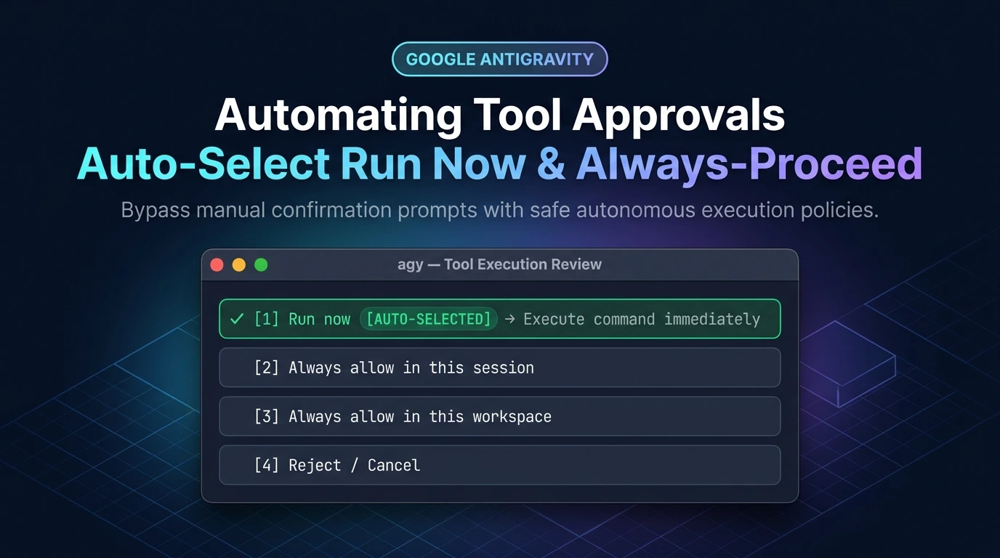
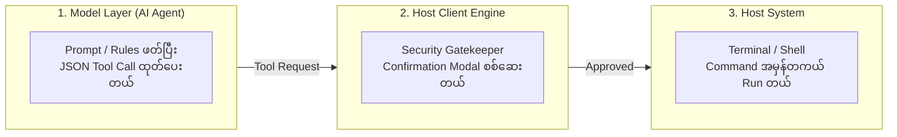

Google Antigravity (IDE, Desktop 2.0 သို့မဟုတ် CLI `agy`) နဲ့ Pair Programming လုပ်တဲ့အခါ Agent က Terminal Command တွေ (`run_command`) run တော့မယ်ဆိုတိုင်း `[1] Run now` ပါတဲ့ Confirmation Box တစ်ခု အမြဲတမ်း ပေါ်လာတတ်ပါတယ်။

အဲဒီအခါ Command အကြိမ် ၅၀-၁၀၀ လောက် ဆက်တိုက် run နေရတဲ့ Task တွေမှာ တစ်ခေါက်ချင်းစီ လိုက်နှိပ်ပေးနေရတာက Coding Flow တော်တော်လေး ပျက်စေပါတယ်။ ဒါပေမဲ့ လူတော်တော်များများ ထင်သလို Agent Prompt ဒါမှမဟုတ် Custom Skill တစ်ခု ဖန်တီးလိုက်ရုံနဲ့ ဒီ 'Run now' Modal Box ကို အလိုအလျောက် ကျော်သွားစေဖို့ မဖြစ်နိုင်ပါဘူး။ 

ဒီနေ့ ဆောင်းပါးမှာတော့ Antigravity ရဲ့ Security Architecture အလုပ်လုပ်ပုံ Source of Truth၊ ဘာကြောင့် Skill တစ်ခုတည်းနဲ့ မရတာလဲဆိုတဲ့ အချက်နဲ့ Host-level မှာ `always-proceed` တကယ်အလုပ်လုပ်အောင် ဘယ်လို ပြင်ဆင်ရမလဲဆိုတာကို အသေးစိတ် ရှင်းပြပေးသွားပါမယ်။



---

## ၁။ အယူအဆလွဲမှားမှုနဲ့ Source of Truth (ဘာကြောင့် Skill တစ်ခုတည်းနဲ့ မရတာလဲ)

ကျွန်တော်တို့ အရင်ဆုံး နားလည်ထားရမှာက **Model Layer (AI Agent)** နဲ့ **Host Client Engine (Antigravity IDE / Desktop App)** ရဲ့ တာဝန်ခွဲခြားမှု ဖြစ်ပါတယ်။



### ဘာကြောင့် AI Prompt / Skill နဲ့ 'Run now' ကို Auto-Click မလုပ်နိုင်တာလဲ

1. **Host-Level Security Sandbox:** Command တွေကို အမှန်တကယ် Run ပေးတာက AI Model မဟုတ်ဘဲ Antigravity ရဲ့ Host Application ဖြစ်ပါတယ်။ Host ရဲ့ Security Sandbox က ခွင့်ပြုချက် မရမချင်း Command ကို Terminal ဆီ ပေးမပို့ပါဘူး။
2. **LLM Prompt ရဲ့ အတိုင်းအတာ:** `AGENTS.md` ထဲမှာဖြစ်စေ၊ Custom `SKILL.md` ထဲမှာဖြစ်စေ "Run commands automatically without asking" လို့ ရေးထားရင် AI Agent က Chat စကားပြောထဲမှာ "ဒီ command run ရမလား" လို့ လာမမေးတော့တာပဲ ဖြစ်ပါမယ်။ Host Application က တောင်းတဲ့ UI Confirmation Modal ကိုတော့ AI က Programmatic အရ လိုက်နှိပ်ပေးလို့ မရပါဘူး။

ဒါကြောင့် စစ်မှန်တဲ့ ဖြေရှင်းနည်းက **Host Application ရဲ့ Tool Execution Policy ကို ကိုယ်တိုင် ပြင်ဆင်ပေးခြင်း** သို့မဟုတ် **Host UI က ပေးထားတဲ့ Built-in Allow Options တွေကို သုံးစွဲခြင်း** ပဲ ဖြစ်ပါတယ်။

---

## ၂။ Confirmation Modal ရဲ့ Option ၄ ခုကို အကျိုးရှိရှိ သုံးစွဲနည်း

Agent က Command တစ်ခု Run တဲ့အခါ ပေါ်လာတဲ့ Modal Box ထဲမှာ Option ၄ ခု ပါရှိပါတယ်-

| Option | အမည် | တကယ်လုပ်ဆောင်ပုံ | အကြံပြုချက် |
| :---: | :--- | :--- | :--- |
| **[1]** | **Run now** | လက်ရှိ Command တစ်ခုတည်းကိုပဲ ချက်ချင်း Run ပေးတယ်။ နောက် Command ကျရင် ထပ်မေးဦးမယ်။ | တစ်ခါတလေ သုံးဖို့ |
| **[2]** | **Always allow in this session** | လက်ရှိ Chat Session ထဲမှာ ဒီ Command အမျိုးအစားကို ထပ်မမေးတော့ဘဲ အလိုအလျောက် Run ပေးတယ်။ | **အမြန်ဆုံး ဖြတ်လမ်း** |
| **[3]** | **Always allow in this workspace** | လက်ရှိ Project/Workspace ထဲမှာ ဒီ Command အမျိုးအစားကို အမြဲတမ်း Whitelist အဖြစ် မှတ်သားပေးလိုက်တယ်။ | **အမြဲတမ်း သုံးဖို့ အကောင်းဆုံး** |
| **[4]** | **Reject / Cancel** | Command ကို ပယ်ဖျက်ပြီး Agent ဆီ Cancelled status ပြန်ပို့ပေးတယ်။ | အန္တရာယ်ရှိ Command တွေကို တားဆီးဖို့ |

> [!TIP]
> **လက်တွေ့ အသုံးဝင်ဆုံး နည်းလမ်း:** အကြိမ်တိုင်း `[1] Run now` ကို အခါ ၁၀၀ လိုက်နှိပ်မယ့်အစား `git`, `npm`, `hugo`, `python` စတဲ့ ကိုယ်ယုံကြည်တဲ့ Base Command တွေအတွက် ပထမဆုံးအကြိမ်မှာတင် **`[2] Always allow in this session`** သို့မဟုတ် **`[3] Always allow in this workspace`** ကို ရွေးချယ်ပေးလိုက်ပါ။ ဒါဆိုရင် နောက်ထပ် Modal ပေါ်မလာတော့ဘဲ Auto Run သွားပါလိမ့်မယ်။

---

## ၃။ Host Surface အလိုက် Always-Proceed အပြည့်အဝ သတ်မှတ်နည်း

Modal လုံးဝ မတက်လာစေဘဲ Tool အားလုံးကို အလိုအလျောက် Run စေချင်ရင် Antigravity ရဲ့ Settings တွေမှာ အောက်ပါအတိုင်း ပြင်ဆင်နိုင်ပါတယ်-

### က။ Antigravity 2.0 (Desktop App)

1. ဘယ်ဘက် အောက်ခြေက **Settings (⚙️ Gear Icon)** ကို နှိပ်ပါ။
2. **Agent Settings** → **Tool Execution Policy** ဆီ သွားပါ။
3. Default ဖြစ်နေတဲ့ `request-review` နေရာမှာ **`always-proceed`** (သို့မဟုတ် Sandboxed Container အတွင်း Run ချင်ရင် `proceed-in-sandbox`) ကို ပြောင်းလဲပေးပါ။
4. လက်ရှိ Workspace တစ်ခုတည်းအတွက် သီးသန့်ထားချင်ရင် **Project Settings** → **Auto-Execution Policy** ကို `always-proceed` လို့ သတ်မှတ်နိုင်ပါတယ်။

### ခ။ Antigravity IDE (VS Code-based)

1. Settings (`Ctrl+,` သို့မဟုတ် `Cmd+,`) ကို ဖွင့်ပါ။
2. Search bar မှာ `Tool Execution Policy` သို့မဟုတ် `antigravity.terminal` လို့ ရှာပါ။
3. Execution Policy ကို **`always-proceed`** သို့ ပြောင်းလဲပေးပါ (သို့မဟုတ် Auto Approve Setting ကို Enable လုပ်ပါ)။

### ဂ။ Antigravity CLI (`agy`)

CLI သုံးတဲ့အခါ Flag တွေနဲ့ တိုက်ရိုက် Auto-Run စေနိုင်ပါတယ်-

```bash
# Auto-run mode နဲ့ စတင်တာ
agy --auto-run

# Permissions အားလုံးကို အလိုအလျောက် သဘောတူပြီး Run တာ (Trusted Workspace တွေအတွက်)
agy -y
```

TUI ဖွင့်ထားချိန်မှာတော့ `/config` လို့ ရိုက်ထည့်ပြီး **Permissions** → **Tool Execution Policy** ထဲကနေ **`always-proceed`** ကို ရွေးချယ်နိုင်ပါတယ်။

---

## ၄။ `AGENTS.md` နဲ့ Best Practice ပေါင်းစပ်ခြင်း

Host Application မှာ `always-proceed` သတ်မှတ်ပြီးပြီဆိုရင် Agent ကိုယ်တိုင်ကလည်း စကားပြောထဲမှာ အချိန်မဖြုန်းဘဲ သွက်သွက်လက်လက် အလုပ်လုပ်နိုင်ဖို့အတွက် Project ရဲ့ `AGENTS.md` (သို့မဟုတ် `GEMINI.md`) ထဲမှာ အောက်ပါအတိုင်း စည်းမျဉ်း ထည့်သွင်းထားပေးနိုင်ပါတယ်-

```markdown
## Autonomous Command Execution Policy

The AI agent MUST proactively execute safe build, test, lint, and inspection commands without pausing to ask the user for verbal permission in chat:

- Safe Commands: `npm run build`, `hugo`, `git status`, `git diff`, `python -m pytest`
- Safety Boundary: Always pause and request explicit verbal confirmation for destructive or unrecoverable actions (e.g. `rm -rf /`, `git push --force`, `git reset --hard`, deleting production databases).
```

ဒီလို ပေါင်းစပ်လိုက်တဲ့အခါ-
1. **Agent ဘက်က:** Chat ထဲမှာ မလိုအပ်ဘဲ "Run ရမလား" လို့ လာမမေးတော့ဘူး။
2. **Host ဘက်က:** `always-proceed` သို့မဟုတ် Workspace Whitelist ရှိနေတဲ့အတွက် UI Confirmation Modal မတက်တော့ဘဲ တိုက်ရိုက် အလုပ်လုပ်သွားပါမယ်။

---

## အနှစ်ချုပ်

Google Antigravity မှာ Command တွေကို အလိုအလျောက် Run ချင်တဲ့အခါ AI Prompt/Skill တစ်ခုတည်းနဲ့ ဖြေရှင်းလို့ မရနိုင်ဘဲ Host-level Security Settings တွေကို နားလည်သဘောပေါက်ထားဖို့ လိုပါတယ်။

* အလွယ်ဆုံးနည်းလမ်းကတော့ Confirmation Box ပေါ်လာချိန်မှာ **`[3] Always allow in this workspace`** ကို ရွေးပေးလိုက်တာ ဖြစ်ပါတယ်။
* အပြည့်အဝ Autonomous ဖြစ်ချင်ရင်တော့ Host Settings ထဲက **`always-proceed`** Policy ကို အသုံးပြုပြီး `AGENTS.md` နဲ့ တွဲသုံးတာက အထိရောက်ဆုံး Source of Truth နည်းလမ်း ဖြစ်ပါတယ်။
