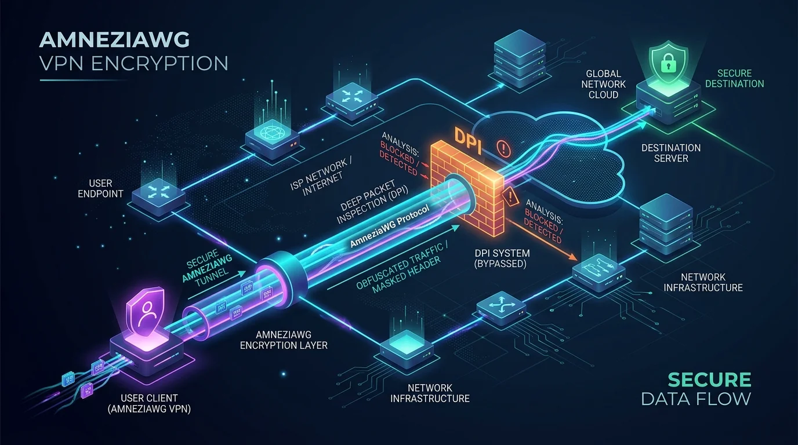

လက်ရှိ မြန်မာနိုင်ငံ၏ အင်တာနက် ပိတ်ဆို့မှု အခြေအနေများတွင် Cloudflare WARP ကဲ့သို့သော ဝန်ဆောင်မှုများ ချိတ်ဆက်မရတော့ခြင်း၊ OpenVPN နှင့် WireGuard တို့၏ Default Port များ (`1194`, `51820` စသည်) သာမက Random Port ပြောင်းလဲအသုံးပြုသော်လည်း ချိတ်ဆက်၍ မရနိုင်တော့သည့် အခြေအနေများနှင့် ရင်ဆိုင်ကြုံတွေ့နေရပါတယ်။

ကျွန်တော့်အနေဖြင့် ယခင်က [VPN Problem I Fixed With OpenVPN](/articles/vpn-problem-i-fixed-with-openvpn/) ဆောင်းပါးတွင် ရေးသားခဲ့သည့်အတိုင်း Raspberry Pi ပေါ်တွင် OpenVPN Hotspot (GoodWifi) တည်ဆောက်ကာ အသုံးပြုခဲ့သော်လည်း OpenVPN Server သက်တမ်းကုန်ဆုံးတော့မည်ဖြစ်ခြင်းနှင့် အဆင့်မြင့် Packet Filtering များကြောင့် ပိုမိုမြန်ဆန်ပြီး ပိတ်ဆို့မှုဒဏ်ကို ခံနိုင်ရည်ရှိသော မျိုးဆက်သစ် VPN စနစ်တစ်ခုကို မဖြစ်မနေ ရှာဖွေတည်ဆောက်ခဲ့ရပါတယ်။

ဒီဆောင်းပါးမှာတော့ WireGuard ၏ မြန်နှုန်းမြင့် စွမ်းဆောင်ရည်ကို အခြေခံထားပြီး Deep Packet Inspection (DPI) ကို လှည့်စားကျော်လွှားနိုင်သည့် **AmneziaWG (AWG)** အကြောင်း၊ DigitalOcean VPS ပေါ်တွင် Server တည်ဆောက်ပုံ၊ Local Debian Desktop နှင့် Raspberry Pi (ARM64) ပေါ်တွင် Client ချိတ်ဆက်စဉ် လက်တွေ့ ကြုံတွေ့ခဲ့ရသော အခက်အခဲများနှင့် ဖြေရှင်းခဲ့သည့် နည်းလမ်းများကို အဆင့်ဆင့် မျှဝေပေးသွားပါမည်။



---

## ၁။ သာမန် WireGuard/OpenVPN များ Random Port ပြောင်းသော်လည်း အဘယ်ကြောင့် ချိတ်မရသနည်း?

အင်တာနက် ပိတ်ဆို့မှု စနစ်များသည် Port နံပါတ်တစ်ခုတည်းကိုသာ စစ်ဆေးပိတ်ပင်ခြင်း မဟုတ်တော့ဘဲ **Deep Packet Inspection (DPI)** နည်းပညာကို အသုံးပြုနေကြခြင်း ဖြစ်ပါတယ်။

- **WireGuard ၏ ပုံသေ Signature:** သာမန် WireGuard Protocol ၏ Handshake Initiation Packet များသည် အမြဲတမ်း ပုံသေ 4-byte Header (`0x01 0x00 0x00 0x00`) ဖြင့် စတင်ပြီး Packet အရွယ်အစားမှာလည်း ပုံသေ `148 bytes` ရှိပါတယ်။
- **OpenVPN ၏ TLS ပုံစံ:** OpenVPN ၏ TLS Handshake ပုံစံသည်လည်း DPI Firewalls များအတွက် ခွဲခြားသိမြင်ရန် အလွန်လွယ်ကူပါတယ်။

ထို့ကြောင့် Port နံပါတ်ကို မည်မျှပင် Random ပြောင်းလဲစေကာမူ DPI စနစ်က ထို Packet Header များကို မြင်တွေ့သည်နှင့် ချက်ချင်း Drop လုပ်ပစ်သည့်အတွက် ချိတ်ဆက်မှု မအောင်မြင်နိုင်ခြင်း ဖြစ်ပါတယ်။

---

## ၂။ AmneziaWG (AWG) က DPI ကို မည်သို့ လှည့်စားကျော်လွှားသနည်း?

**AmneziaWG** သည် WireGuard ၏ Source Code ကို အခြေခံပြီး Censorship Bypass လုပ်နိုင်ရန် သီးသန့် အဆင့်မြှင့်တင်ထားသော Open-Source Protocol တစ်ခု ဖြစ်ပါတယ်။

AmneziaWG သည် အောက်ပါ Obfuscation Parameter များကို ထည့်သွင်းထားပါတယ် -

1. **Junk Packets (`Jc`, `Jmin`, `Jmax`):** အမှန်တကယ် Handshake မစတင်မီ DPI စနစ်ကို မျက်စိလည်သွားစေရန် ကျပန်း အမှိုက် Packet အရေအတွက်နှင့် အရွယ်အစားများကို အရင် ကြိုတင် ပေးပို့ပါတယ်။
2. **Packet Padding (`S1`, `S2`):** Initiation နှင့် Response Packet များ၏ ပုံသေ အရွယ်အစား (148/92 bytes) မဖြစ်စေရန် Random Padding Bytes များကို ကပ်ပေးလိုက်ပါတယ်။
3. **Magic Headers (`H1`, `H2`, `H3`, `H4`):** WireGuard ၏ မူလ ပုံသေ Message Type Headers များနေရာတွင် Client နှင့် Server အကြား သဘောတူထားသော Custom 32-bit Random Integers များကို အစားထိုး အသုံးပြုပါတယ်။

ရလဒ်အနေဖြင့် DPI စနစ်၏ အမြင်တွင် ဤ Packet များသည် WireGuard သို့မဟုတ် VPN ဟု မသိရှိနိုင်တော့ဘဲ အဓိပ္ပာယ်ဖော်မရသော သာမန် UDP Data Noise အဖြစ်သာ မြင်တွေ့ရသဖြင့် ပိတ်ဆို့မှုမှ လွတ်မြောက်သွားပါတယ်။

---

## ၃။ DigitalOcean VPS တွင် AmneziaWG Server တည်ဆောက်ခြင်းနှင့် တွေ့ကြုံခဲ့ရသော Error များ

ကျွန်တော့်၏ DigitalOcean VPS (Ubuntu 24.04 Noble) ပေါ်တွင် Server စတင် တည်ဆောက်စဉ် အောက်ပါ အဆင့်များနှင့် Error များကို ဖြေရှင်းခဲ့ရပါတယ်။

### ပြဿနာ (၁) - DigitalOcean Cloud Firewall
DigitalOcean Droplet (VPS) များတွင် Linux အတွင်းပိုင်း `ufw`/`iptables` အပြင် Web Dashboard တွင် **External Firewall Policy** သီးသန့် ရှိနေတတ်ပါတယ်။ ထို Firewall တွင် မိမိအသုံးပြုမည့် Custom UDP Port (ဥပမာ `41194`) နှင့် Web UI Port (`51821`) ကို ဖွင့်မပေးပါက ပြင်ပမှ မည်သို့မျှ ချိတ်ဆက်၍ ရမည် မဟုတ်ပါ။

**ဖြေရှင်းနည်း:** DigitalOcean Dashboard > Networking > Firewalls ထဲတွင် Inbound Rule အသစ်များ (UDP `41194`, TCP `51821`) ကို အရင် ဖွင့်ပေးခဲ့ရပါတယ်။

### ပြဿနာ (၂) - `docker-compose-plugin` ရှာမတွေ့ခြင်းမှသည် Package Conflict အထိ အဆင့်ဆင့် ဖြေရှင်းခဲ့ရပုံ

AmneziaWG ကို Docker Compose ဖြင့် Run ရန်အတွက် Ubuntu 24.04 ပေါ်တွင် စတင်စဉ် ပထမဆုံးအနေဖြင့် အောက်ပါအတိုင်း Docker နှင့် Compose Plugin ကို သွင်းယူခဲ့ပါတယ် -

```bash
sudo apt update && sudo apt install -y docker.io docker-compose-plugin
```

သို့သော် Ubuntu ၏ Default Repository ထဲတွင် Compose Plugin မရှိသဖြင့် အောက်ပါအတိုင်း ပက်ကေ့ဂျ် ရှာမတွေ့ကြောင်း Error စတင် တက်လာခဲ့ပါတယ် -
```text
Reading package lists... Done
Building dependency tree... Done
Reading state information... Done
E: Unable to locate package docker-compose-plugin
```

ထို့ကြောင့် `docker-compose-plugin` ရရှိနိုင်ရန်အတွက် Docker ၏ Official GPG Key နှင့် Repository ကို စတင် ထည့်သွင်းပေးခဲ့ပါတယ် -

```bash
sudo apt update
sudo apt install -y ca-certificates curl
sudo install -m 0755 -d /etc/apt/keyrings
sudo curl -fsSL https://download.docker.com/linux/ubuntu/gpg -o /etc/apt/keyrings/docker.asc
sudo chmod a+r /etc/apt/keyrings/docker.asc

echo \
  "deb [arch=$(dpkg --print-architecture) signed-by=/etc/apt/keyrings/docker.asc] https://download.docker.com/linux/ubuntu \
  $(. /etc/os-release && echo \"$VERSION_CODENAME\") stable" | \
  sudo tee /etc/apt/sources.list.d/docker.list > /dev/null
```

Repository ထည့်သွင်းပြီးနောက် `sudo apt update && sudo apt install -y docker.io docker-compose-plugin` ကို ထပ်မံ Run သည့်အခါ ဒုတိယ အဆင့်အနေဖြင့် အောက်ပါ Dependency Conflict Error ကို ရင်ဆိုင်ခဲ့ရပြန်ပါတယ် -
```text
The following packages have unmet dependencies:
 containerd.io : Conflicts: containerd
E: Error, pkgProblemResolver::Resolve generated breaks, this may be caused by held packages.
```

**အကြောင်းရင်း:** Ubuntu ၏ မူလ `docker.io` ပက်ကေ့ဂျ်က `containerd` ကို အသုံးပြုရန် ကြိုးစားနေပြီး Docker Official Repository မှ `docker-compose-plugin` ကကျတော့ `containerd.io` ကို တောင်းဆိုနေသဖြင့် ပက်ကေ့ဂျ်နှစ်ခု အချင်းချင်း တိုက်ဆိုင် (Conflict) ဖြစ်သွားခြင်း ဖြစ်ပါတယ်။

**နောက်ဆုံး ဖြေရှင်းနည်း:** Conflict ဖြစ်နေသော Ubuntu default ပက်ကေ့ဂျ်ဟောင်းများကို အရင်ဆုံး အပြီးအပိုင် ရှင်းလင်းဖယ်ရှားပြီးမှသာ Docker Official Suite (`docker-ce`) အပြည့်အစုံကို သွင်းယူကာ ပြဿနာကို ချောမောစွာ ဖြေရှင်းနိုင်ခဲ့ပါတယ် -

```bash
# Conflict ဖြစ်နေသော ပက်ကေ့ဂျ်ဟောင်းများကို ဖယ်ရှားခြင်း
sudo apt remove -y containerd docker.io runc

# Docker Official Packages (docker-ce) များကို အပြည့်အစုံ သွင်းယူခြင်း
sudo apt update
sudo apt install -y docker-ce docker-ce-cli containerd.io docker-buildx-plugin docker-compose-plugin
sudo systemctl enable --now docker
```

### ပြဿနာ (၃) - Docker Registry `denied` ဖြစ်ခြင်းနှင့် Web UI ရွေးချယ်ခြင်း
`ghcr.io/amnezia-vpn/amnezia-wg:latest` ဟူသော Image ကို ဆွဲယူရာတွင် Registry ဘက်မှ Denied Error ပြသခဲ့ပါတယ်။ အကြောင်းမှာ Amnezia အဖွဲ့အနေဖြင့် ထို Image နာမည်ဖြင့် Public Standalone Image မထုတ်ပေးထားခြင်းကြောင့် ဖြစ်ပါတယ်။

**ဖြေရှင်းနည်း:** AmneziaWG Protocol ပေါင်းစပ်ထားပြီး အသုံးပြုရ အလွန်လွယ်ကူသည့် Web Dashboard ပါဝင်သော **`amnezia-wg-easy`** Image သို့ ပြောင်းလဲ အသုံးပြုခဲ့ပါတယ် -

```yaml
# ~/amneziawg/docker-compose.yml
services:
  amnezia-wg-easy:
    image: ghcr.io/imbtqd/amnezia-wg-easy:latest
    container_name: amnezia-wg-easy
    environment:
      - LANGUAGE=en
      - WG_HOST=YOUR_VPS_PUBLIC_IP
      - PASSWORD=YourStrongPassword
      - PORT=51821
      - WG_PORT=41194
      - WG_PATH=/etc/amnezia/amneziawg
    volumes:
      - ~/.amnezia-wg-easy:/etc/amnezia/amneziawg
    ports:
      - "41194:41194/udp"
      - "51821:51821/tcp"
    cap_add:
      - NET_ADMIN
      - SYS_MODULE
    sysctls:
      - net.ipv4.conf.all.src_valid_mark=1
      - net.ipv4.ip_forward=1
    devices:
      - /dev/net/tun:/dev/net/tun
    restart: unless-stopped
```

`sudo docker compose up -d` ဖြင့် Run ပြီးနောက် Browser မှ `http://YOUR_VPS_IP:51821` သို့ ဝင်ရောက်ကာ Client Configuration (`Pi.conf`) များကို အလွယ်တကူ Download ရယူနိုင်ခဲ့ပါတယ်။

---

## ၄။ Client Configuration File (`.conf`) နေရာချထားခြင်းနှင့် Desktop/Mobile တွင် စမ်းသပ်ခြင်း

Download ဆွဲထားတဲ့ `Pi.conf` ကို Client စက်တွေမှာ စတင် မချိတ်ဆက်ခင် `awg-quick` က ဖတ်မယ့် လမ်းကြောင်းထဲ သေချာ နေရာချပေးဖို့ လိုပါတယ်။

### Debian Desktop ပေါ်တွင် Config File နေရာချထားခြင်း
Browser ကနေ Download ဆွဲလိုက်တဲ့ ဖိုင် (ဥပမာ `~/Downloads/Pi.conf`) ကို `awg-quick` က အလိုအလျောက် interface နာမည်အဖြစ် သတ်မှတ်နိုင်အောင် `/etc/amnezia/amneziawg/awg0.conf` အဖြစ် ကူးယူပေးရပါတယ်။ WireGuard/AmneziaWG ဖိုင်ထဲမှာ Private Key တွေ ပါဝင်တာကြောင့် လုံခြုံရေးအရ Root သာ ဖတ်နိုင်အောင် `chmod 600` ပေးရပါမယ် -

```bash
# Configuration directory ဆောက်ပြီး file ကို ကူးယူခြင်း
sudo mkdir -p /etc/amnezia/amneziawg
sudo cp ~/Downloads/Pi.conf /etc/amnezia/amneziawg/awg0.conf

# Root user တစ်ဦးတည်းသာ ဖတ်ခွင့်ရအောင် permission သတ်မှတ်ခြင်း
sudo chmod 600 /etc/amnezia/amneziawg/awg0.conf
```

Client တွေပေါ်မှာ စမ်းသပ်တဲ့အခါ စိတ်ဝင်စားဖို့ကောင်းတဲ့ Error တွေကို ဆက်လက် ဖြေရှင်းခဲ့ရပါတယ် -

### ပြဿနာ (၄) - Standard WireGuard App တွင် "Invalid VPN configuration profile" ပြခြင်း
ဖုန်း သို့မဟုတ် Desktop ရှိ Standard WireGuard App ထဲသို့ `Pi.conf` ကို ထည့်သွင်းသည့်အခါ အလုပ်မလုပ်ဘဲ Error တက်ပါတယ်။

**အကြောင်းရင်း:** သာမန် WireGuard App များသည် AmneziaWG ၏ Obfuscation Header များဖြစ်သော `Jc`, `Jmin`, `S1`, `H1-H4` စသည့် စာကြောင်းများကို နားမလည်ဘဲ Unrecognized Directives အဖြစ် ငြင်းပယ်ခြင်း ဖြစ်ပါတယ်။

**ဖြေရှင်းနည်း:** Standard WireGuard အစား Google Play Store, iOS App Store သို့မဟုတ် GitHub Releases များမှ **"AmneziaWG"** သီးသန့် Client App ကို အသုံးပြုမှသာ ပြဿနာမရှိ ချိတ်ဆက်နိုင်မှာ ဖြစ်ပါတယ်။

### ပြဿနာ (၅) - Debian တွင် `ip link add awg0 type amneziawg: Error: Unknown device type`
Debian Terminal မှာ `sudo awg-quick up awg0` Run တဲ့အခါ Kernel Module မရှိတာကြောင့် အောက်ပါအတိုင်း Device Type ကို မသိတဲ့ Error ပြသခဲ့ပါတယ် -

```text
[#] ip link add awg0 type amneziawg
Error: Unknown device type.
Unable to access interface: Protocol not supported
```

### ပြဿနာ (၆) - UEFI Secure Boot ကြောင့် Kernel Module Rejected ခံရခြင်းနှင့် Missing Module Warning
`amneziawg-dkms` ကို အသုံးပြုပြီး Kernel Module တည်ဆောက်ထားပေမဲ့လည်း `sudo modprobe amneziawg` နှိပ်တဲ့အခါ ဒါမှမဟုတ် `sudo awg-quick up awg0` ခေါ်တဲ့အခါ အောက်ပါအတိုင်း ငြင်းပယ်ခံရပါတယ် -

```text
modprobe: ERROR: could not insert 'amneziawg': Key was rejected by service
```
သို့မဟုတ်
```text
[#] ip link add awg0 type amneziawg
Error: Unknown device type.
[!] Missing WireGuard (Amnezia VPN) kernel module. Falling back to slow userspace implementation.
```

**အကြောင်းရင်း:** Debian စက်မှာ **UEFI Secure Boot** ဖွင့်ထားတာကြောင့် ဖြစ်ပါတယ်။ DKMS က `amneziawg` kernel module ကို compile လုပ်ပြီး sign လုပ်ပေးထားပေမဲ့ အဲဒီ MOK (Machine Owner Key) signing certificate (`/var/lib/dkms/mok.pub`) ကို UEFI ထဲ Enroll မလုပ်ရသေးသရွေ့ Linux Kernel Lockdown ကြောင့် module ကို load လုပ်ခွင့်မပြုဘဲ ပိတ်ထားတာ ဖြစ်ပါတယ်။

### အဓိက ဖြေရှင်းနည်း (အကြံပြုလိုတဲ့ နည်းလမ်း ၁) - MOK Key ကို Enroll လုပ်ပြီး Native Kernel Module အသုံးပြုခြင်း
Userspace implementation (`amneziawg-go`) က CPU နဲ့ memory သုံးစွဲမှု ပိုများတဲ့အပြင် throughput ပိုင်းမှာ Native Kernel Module လောက် မမြန်ပါဘူး။ ဒါကြောင့် အမြဲတမ်းအတွက် အကောင်းဆုံး နည်းလမ်းကတော့ DKMS ရဲ့ MOK Key ကို UEFI MOK Database ထဲ Enroll လုပ်ပေးလိုက်တာ ဖြစ်ပါတယ်။

**အဆင့် (၁) - MOK Key ကို mokutil သုံးပြီး Import လုပ်ခြင်း:**
Terminal မှာ အောက်ပါ command ကို Run ပါတယ် -
```bash
sudo mokutil --import /var/lib/dkms/mok.pub
```
*(ဒီအဆင့်မှာ Temporary Password တစ်ခု တောင်းပါမယ်။ ဥပမာ `12345678` လိုမျိုး မှတ်မိလွယ်တဲ့ password တစ်ခုကို နှစ်ကြိမ် ရိုက်ထည့်ပေးပါ)*

**အဆင့် (၂) - စက်ကို Reboot ချပြီး MOK Enroll လုပ်ခြင်း:**
```bash
sudo reboot
```
စက်ပြန်တက်လာချိန်မှာ အပြာရောင်/မီးခိုးရောင် **"Perform MOK management"** မျက်နှာပြင် ပေါ်လာပါမယ် -
1. **Enroll MOK** ကို ရွေးပြီး Enter နှိပ်ပါ။
2. **Continue** (သို့မဟုတ် View key 0) ကို ရွေးပါ။
3. "Enroll the key(s)?" မေးတဲ့အခါ **Yes** ကို ရွေးပါ။
4. အဆင့် (၁) မှာ ထည့်ခဲ့တဲ့ Password ကို ရိုက်ထည့်ပေးပါ။
5. **Reboot** ကို ရွေးပေးလိုက်ပါ။

**အဆင့် (၃) - စစ်ဆေးအတည်ပြုခြင်း:**
စက်ပြန်တက်လာတဲ့အခါ module ကို တိုက်ရိုက် load လုပ်နိုင်သွားပါပြီ -
```bash
sudo modprobe amneziawg
sudo awg-quick up awg0
```
အခုဆိုရင် `Error: Unknown device type.` နဲ့ `Missing WireGuard kernel module` warning တွေ လုံးဝမတက်တော့ဘဲ High-Speed Native Kernel Module နဲ့ အပြည့်အဝ အောင်မြင်စွာ အလုပ်လုပ်သွားပါပြီ။

### အရန် ဖြေရှင်းနည်း (Alternative) - `amneziawg-go` Userspace Binary အသုံးပြုခြင်း
အကယ်၍ စက်ကို ချက်ချင်း Reboot မချချင်တာ သို့မဟုတ် BIOS/UEFI MOK Key မသွင်းချင်ဘူးဆိုရင်တော့ Go Language နဲ့ ရေးထားတဲ့ Userspace Implementation **`amneziawg-go`** ကို သုံးပြီး ယာယီ ကျော်လွှားနိုင်ပါတယ် -

```bash
# amneziawg-go ကို compile လုပ်ပြီး install ပြုလုပ်ခြင်း
git clone --depth 1 https://github.com/amnezia-vpn/amneziawg-go.git
cd amneziawg-go && make
sudo cp amneziawg-go /usr/bin/amneziawg-go
sudo chmod +x /usr/bin/amneziawg-go
```

`amneziawg-go` ရှိနေရင် `awg-quick` က Kernel module မရှိတဲ့အခါ Userspace `/dev/net/tun` Driver အနေနဲ့ fallback ဆင်းပြီး အလိုအလျောက် ရွေးချယ် အသုံးပြုပေးသွားမှာ ဖြစ်ပါတယ်။ (ဒါမှမဟုတ် နောက်ထပ် ရိုးရှင်းတဲ့နည်းလမ်းတစ်ခုကတော့ BIOS/UEFI Settings ထဲကနေ Secure Boot ကို Disabled ပေးလိုက်တာလည်း ဖြစ်ပါတယ်)။

`curl https://ifconfig.me` စစ်ဆေးကြည့်တဲ့အခါ ကျွန်တော့်ရဲ့ DigitalOcean VPS Public IP ကို ချက်ချင်း ပြသနိုင်ခဲ့ပြီး Debian Desktop နဲ့ Android ဖုန်းတွေမှာ အောင်မြင်စွာ ချိတ်ဆက်နိုင်ခဲ့ပါတယ်။


---

## ၅။ Raspberry Pi (ARM64) သို့ ချိတ်ဆက်ခြင်းနှင့် ရင်ဆိုင်ခဲ့ရသော ပြဿနာများ

နောက်ဆုံး အဆင့်အနေဖြင့် အိမ်ရှိ Raspberry Pi (Bookworm Debian 12, aarch64) ပေါ်သို့ Client ပြောင်းရွှေ့ တပ်ဆင်ခဲ့ပါတယ်။

### ပြဿနာ (၇) - Glibc Incompatibility (Ubuntu 24.04 Noble vs Debian 12 Bookworm)
PPA ထည့်သွင်းစဉ် Ubuntu 24.04 (`noble`) Repository ကို သုံးမိသည့်အတွက် `amneziawg-tools` ပက်ကေ့ဂျ်တွင် Broken Dependencies ပြဿနာ ဖြစ်ပွားခဲ့ပါတယ် -
```text
The following packages have unmet dependencies:
 amneziawg : Depends: amneziawg-tools (>= ...) but it is not installable
E: Unable to correct problems, you have held broken packages.
```
အကြောင်းမှာ Ubuntu Noble သည် `glibc 2.39` ကို အခြေခံထားပြီး Debian 12 (Bookworm) သည် `glibc 2.36` ဖြစ်နေခြင်းကြောင့် ဖြစ်ပါတယ်။

**ဖြေရှင်းနည်း:** PPA Distribution ကို Debian 12 နှင့် 100% Binary Compatible ဖြစ်သော Ubuntu 22.04 (**`jammy`**) သို့ ပြောင်းလဲပေးခဲ့ပါတယ် -

```bash
echo "deb [signed-by=/etc/apt/keyrings/amnezia.gpg] https://ppa.launchpadcontent.net/amnezia/ppa/ubuntu jammy main" | sudo tee /etc/apt/sources.list.d/amnezia.list
sudo apt update
sudo apt install -y amneziawg
```

*(မှတ်ချက် - Raspberry Pi များတွင် UEFI Secure Boot မရှိသည့်အတွက် Kernel Module သည် မည်သည့် Error မှ မတက်ဘဲ ချောမွေ့စွာ Build လုပ်နိုင်ခဲ့ပါတယ်)*။

### Raspberry Pi ပေါ်သို့ Configuration File ကို `scp` ဖြင့် ပို့ဆောင်ပြီး နေရာချထားခြင်း
Raspberry Pi လိုမျိုး Desktop Browser မရှိတဲ့ Headless စနစ်တွေအတွက် Local Desktop ကနေ `scp` သုံးပြီး `Pi.conf` ကို လှမ်းပို့ပေးနိုင်ပါတယ် -

```bash
# Local Desktop Terminal ကနေ Raspberry Pi ဆီ ဖိုင်လှမ်းပို့ခြင်း
scp ~/Downloads/Pi.conf pi@192.168.x.x:/home/pi/awg0.conf
```

အဲဒီနောက် Raspberry Pi ထဲကို SSH ဝင်ပြီး `/etc/amnezia/amneziawg/awg0.conf` လမ်းကြောင်းထဲ ရွှေ့ကာ လုံခြုံရေး permission သတ်မှတ်ပေးရပါတယ် -

```bash
# Raspberry Pi Terminal ပေါ်မှာ
sudo mkdir -p /etc/amnezia/amneziawg
sudo mv /home/pi/awg0.conf /etc/amnezia/amneziawg/awg0.conf
sudo chmod 600 /etc/amnezia/amneziawg/awg0.conf
```

### ပြဿနာ (၈) - `resolvconf: command not found`
Config ထည့်သွင်းပြီး ချိတ်ဆက်သည့်အခါ DNS ပြင်ဆင်ရန် `resolvconf` ရှာမတွေ့သည့် Error တက်ခဲ့ပါတယ် -
```text
/usr/bin/awg-quick: line 32: resolvconf: command not found
```

**ဖြေရှင်းနည်း:** Debian အတွက် Standard DNS Tool ဖြစ်သော `openresolv` ကို သွင်းယူလိုက်ပါသည် -
```bash
sudo apt install -y openresolv
```

နောက်ဆုံးတွင် Raspberry Pi ပေါ်တွင်လည်း `sudo awg-quick up awg0` အောင်မြင်စွာ တက်လှမ်းနိုင်ခဲ့ပြီး Handshake Transfer များနှင့်အတူ VPS IP သို့ အပြည့်အဝ ချိတ်ဆက် အသုံးပြုနိုင်ခဲ့ပါတယ်။

---

## ၆။ Hotspot (GoodWifi) ဖြင့် တွဲဖက်အသုံးပြုရန် ဆက်လက်လုပ်ဆောင်မည့် အချက်များ

လက်ရှိ ကျွန်တော့်၏ Raspberry Pi တွင် GoodWifi Hotspot စနစ် ရှိနေပြီး Policy Routing (Table 100) ဖြင့် စီမံထားပါတယ်။ AmneziaWG ကို ထို Hotspot စနစ်ထဲသို့ ထည့်သွင်းရာတွင် အရေးကြီးသည့် လျှို့ဝှက်ချက်မှာ -

`/etc/amnezia/amneziawg/awg0.conf` ထဲတွင် အောက်ပါစာကြောင်းကို ထည့်သွင်းပေးရန် ဖြစ်ပါတယ် -
```ini
[Interface]
...
Table = off
```

`Table = off` ကို အသုံးပြုခြင်းဖြင့် AmneziaWG က Raspberry Pi ရဲ့ Main Routing Table (`eth0`, SSH, Local Services, Cloudflared) ကို မထိခိုက်စေဘဲ Hotspot Client များအတွက် သီးသန့် Routing များကို ကျွန်တော်တို့ စိတ်ကြိုက် ဆက်လက် လမ်းကြောင်းခွဲနိုင်မှာ ဖြစ်ပါတယ်။

---

## နိဂုံးချုပ် (Summary)

ဒီ Project ကနေ ရရှိခဲ့တဲ့ အဓိက အတွေ့အကြုံများမှာ -
1. DPI နည်းပညာများ ရှိလာသည့်အခါ Port Randomization ထက် **Protocol Header Masking (AmneziaWG)** ကဲ့သို့သော နည်းပညာရပ်များက ပိုမို အကျိုးသက်ရောက်မှုရှိခြင်း။
2. Linux Server ပေါ်တွင် Docker Package Conflict များကို စနစ်တကျ Clean up လုပ်တတ်ရန် လိုအပ်ခြင်း။
3. UEFI Secure Boot ရှိတဲ့ Desktop တွေမှာ Kernel Module အတွက် **MOK (Machine Owner Key) ကို Enroll လုပ်ပြီး** Native Kernel Driver အပြည့်အဝ အသုံးပြုနိုင်ခြင်း (ဒါမှမဟုတ် `amneziawg-go` Userspace Driver နဲ့ အစားထိုးနိုင်ခြင်း)။
4. Debian နှင့် Ubuntu PPA ချိတ်ဆက်ရာတွင် **Glibc Compatibility (`jammy` vs `noble`)** ကို သတိပြုရွေးချယ်ရခြင်း စသည်တို့ ဖြစ်ပါတယ်။

---

## အသိပေးရှင်းလင်းချက် (Personal Educational Disclaimer)

> **အရေးကြီးသော မှတ်ချက် (Disclaimer):**
> 
> ဤဆောင်းပါးသည် ကွန်ပျူတာ ကွန်ရက် (Computer Networking)၊ Linux Kernel System၊ Docker နှင့် Open-Source နည်းပညာများကို **ကိုယ်တိုင် လေ့လာစူးစမ်း သင်ယူမှု (Personal Learning & Educational Research)** အတွက်သာ ရေးသားထားသော ကိုယ်ပိုင် နည်းပညာ မှတ်တမ်းတစ်ခု ဖြစ်ပါတယ်။
> 
> ကျွန်တော့်အနေဖြင့် နည်းပညာရပ်များကို စူးစမ်းရှာဖွေရင်း AmneziaWG ဟူသော Open-Source ပရောဂျက်ကို တွေ့ရှိခဲ့သည့်အတွက် မိမိ၏ **ကိုယ်ပိုင် အိမ်တွင်းသုံး (Personal & Home Lab Usage)** သီးသန့် အနေဖြင့်သာ စမ်းသပ် တည်ဆောက်ခဲ့ခြင်း ဖြစ်ပါတယ်။ သက်ဆိုင်ရာ အစိုးရ သို့မဟုတ် အဖွဲ့အစည်းများမှ ချမှတ်ထားသော ကန့်သတ်ချက်များကို အတင်းအကြပ် ရည်ရွယ်ချက်ရှိရှိ လိုက်လံ ကျော်လွှားရန် သို့မဟုတ် အခြား မည်သည့် မသမာသော ကိစ္စရပ်များအတွက်မျှ ရည်ရွယ်ထားခြင်း မဟုတ်ပါ။
> 
> အင်ဂျင်နီယာနှင့် နည်းပညာ လေ့လာသူများအချင်းချင်းအတွက် Linux စနစ်များတွင် ကြုံတွေ့ရတတ်သည့် Package Conflict များ၊ Kernel Module နှင့် Secure Boot ဆိုင်ရာ ပြဿနာများကို ဖြေရှင်းသည့် လက်တွေ့ ဗဟုသုတ အတွေ့အကြုံတစ်ခု (Troubleshooting Knowledge Sharing) အဖြစ်သာ ဖော်ပြထားခြင်း ဖြစ်ပါကြောင်း အသိပေး ဖော်ပြအပ်ပါသည်။
