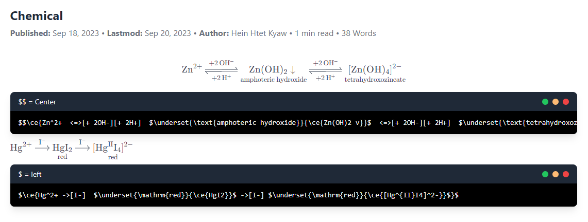

$$\ce{Zn^2+  <=>[+ 2OH-][+ 2H+]  $\underset{\text{amphoteric hydroxide}}{\ce{Zn(OH)2 v}}$  <=>[+ 2OH-][+ 2H+]  $\underset{\text{tetrahydroxozincate}}{\ce{[Zn(OH)4]^2-}}$}$$

```{title="$$ = Center"}
$$\ce{Zn^2+  <=>[+ 2OH-][+ 2H+]  $\underset{\text{amphoteric hydroxide}}{\ce{Zn(OH)2 v}}$  <=>[+ 2OH-][+ 2H+]  $\underset{\text{tetrahydroxozincate}}{\ce{[Zn(OH)4]^2-}}$}$$
```

$\ce{Hg^2+ ->[I-]  $\underset{\mathrm{red}}{\ce{HgI2}}$ ->[I-]
$\underset{\mathrm{red}}{\ce{[Hg^{II}I4]^2-}}$}$

```{title="$ = left"}
$\ce{Hg^2+ ->[I-]  $\underset{\mathrm{red}}{\ce{HgI2}}$ ->[I-] $\underset{\mathrm{red}}{\ce{[Hg^{II}I4]^2-}}$}$
```



chemical forumla တွေကတော့ ပုံပါအတိုင်းပါပဲ xD
