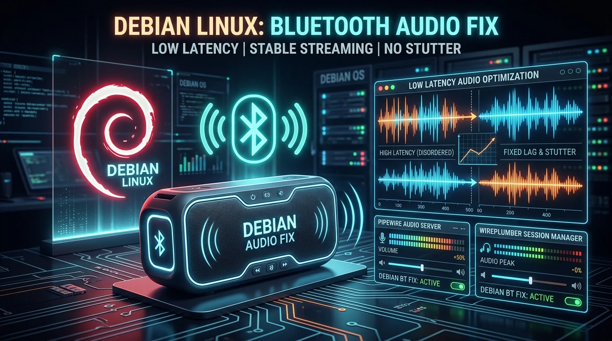

ဒီ Desktop မှာ Bluetooth adapter က **Intel 8087:0a2b** (USB port `1-7`) တစ်ခုတည်းကိုပဲ Bluetooth ပစ္စည်း ၃ ခုက မျှသုံးနေပါတယ် - **T90 Mouse1** ၊ **IP98S Pro BT1** ကီးဘုတ်နဲ့ **MI Portable Speaker** ပါ။ Speaker နဲ့ ဂီတဖွင့်လိုက်တဲ့အခါ ရံဖန်ရံခါ ဖျစ်ဖျစ်/တဒိန်းဒိန်း ဖြစ်ပြီး နောက်ကျတာမျိုး (Audio Lag) ကြုံရလို့ တစ်ဆင့်ချင်းစီ စစ်ပြီး ဖြေရှင်းထားတဲ့ မှတ်တမ်းပါ။ ဖြေရှင်းချက်တွေက ဒီစက်အတွက် အလုပ်ဖြစ်တာတွေမို့ **command တိုင်း ကိုယ့်စက်မှာ ဖတ်ပြီး** ကိုက်ညီမှသာ သုံးပါ။



## လက်ရှိ System နဲ့ ချိတ်ဆက်ထားတဲ့ Device တွေ

- Debian 13 (Trixie) ကိုအသုံးပြုပြီး Audio တွေကို **PipeWire 1.4.2** နဲ့ **WirePlumber 1.4.2** က စီမံနေပါတယ်။
- Speaker: **MI Portable Speaker** `84:26:7A:6E:A2:39` - A2DP `a2dp-sink` profile နဲ့ run နေလို့ audio output node က `bluez_output.84_26_7A_6E_A2_39.1` ဖြစ်ပါတယ်။
- Speaker ရဲ့ service record မှာ Audio Sink ၊ A2DP ၊ Handsfree (HFP) UUID တွေ ပါနေလို့ PipeWire ဘက်က ဒီ device ဟာ HFP capability ပါ တွေ့နေတယ်။
- Wi-Fi က **2.4 GHz၊ Channel 1** မှာပဲ ရှိပြီး ဒီနေရာမှာ 5 GHz network မရှိပါဘူး။

## ပြဿနာ (Symptoms)

1. Speaker ကနေ ဂီတ ဖွင့်နေချိန် **ရံဖန်ရံခါ ဖျစ်ဖျစ်/stutter** ဖြစ်တာ၊ နောက်ကျတာမျိုး။
2. Notification bar / Quick Settings မှာရှိတဲ့ **Media Control** တွေနဲ့ Speaker ရဲ့ playback ကို ထိန်းလို့မရဘဲ ခံစားရတာ။

Stutter က မြဲမြံစွာဖြစ်တာမဟုတ်ဘဲ အခါအားလျော်စွာ ဖြစ်တာမို့ Bluetooth audio transport ပြတ်တောက်မှုမျိုး (transport error) ဖြစ်နိုင်တယ်လို့ သံသယ ရှိတယ်။ ဒါကြောင့် log တွေကို စစ်ကြည့်တယ်။

## Step 1: Audio Node ရဲ့ လက်ရှိအခြေအနေ စစ်ဆေးခြင်း

```bash
wpctl status
pw-dump
```

သက်ဆိုင်ရာ စက်မှာ `pw-dump` ရဲ့ ရလဒ်က

```text
bluez_output.84_26_7A_6E_A2_39.1  →  state: running  |  api.bluez5.codec: sbc_xq  |  profile: a2dp-sink
```

ဖြစ်နေတယ်။ Node က `running` ဖြစ်ပေမယ့် codec က **sbc_xq** (bitrate အများဆုံး ~452 kbit/s လောက်သုံး) ဖြစ်နေတယ်။ ဒီ node ကိုတော့ အခုတော့ အောက်ကအဆင့်တွေလုပ်ပြီးတဲ့အခါ codec `sbc` ဖြစ်သွားမယ်။

## Step 2: journalctl ထဲက Bluetooth သဲလွန်စများ ရှာခြင်း

```bash
journalctl -b | grep -iE "bluez|bluetooth" | grep -iE "error|failed|invalid|rfcomm"
```

တွေ့ရတာတွေက-

```text
spa.bluez5.device: trying to set invalid profile 3, codec 257
spa.bluez5.native: RFCOMM receive command but modem not available: AT+CHLD=?
spa.bluez5.native: RFCOMM receive command but modem not available: AT+NREC=0
Failure in Bluetooth audio transport .../sep1/fd6 ... error 24
pw.node: (bluez_output...: running -> error (Received error event)
```

ဒီကနေ ပြဿနာရင်းမြစ် ၄ ခု ပေါ်လာတယ်။

## Root Cause ၁: BT Adapter က USB Autosuspend ဖြစ်နေတာ

```bash
cat /sys/bus/usb/devices/1-7/power/control        # auto  ← သံသယရှိ
cat /sys/module/btusb/parameters/enable_autosuspend  # Y
```

Intel BT adapter က USB ကနေ autosuspend ဖြစ်နိုင်နေရင် radio ပေါ့သွားပြီး A2DP transport ပြတ်တောက်နိုင်တယ်။ `error 24` + `running → error` ဆိုတာ ဒီလိုအခြေအနေမျိုးနဲ့ လိုက်ဖက်တယ်။

**ဖြေရှင်းချက် - ချက်ချင်း sysfs + နောက် boot တိုင်း udev rule**

```bash
sudo sh -c 'echo on > /sys/bus/usb/devices/1-7/power/control'
```

ပြီးရင် permanent ဖြစ်ဖို့ `/etc/udev/rules.d/50-bt-disable-autosuspend.rules` ကို ဖန်တီးထားလိုက်တယ်-

```text
# Disable USB autosuspend for the Intel Bluetooth adapter (8087:0a2b)
ACTION=="add", SUBSYSTEM=="usb", ATTR{idVendor}=="8087", ATTR{idProduct}=="0a2b", ATTR{power/control}="on"
```

```bash
sudo udevadm control --reload
sudo udevadm trigger --subsystem-match=usb
cat /sys/bus/usb/devices/1-7/power/control   # on
```

## Root Cause ၂: Controller က Discovery Scanning လုပ်နေတာ

```bash
bluetoothctl show | grep -i Discovering
```

အဖြေက `Discovering: yes` ဖြစ်နေတယ်။ ဒါက ဘာကိုပြတာလဲဆိုတော့ BT controller က ပတ်ဝန်းကျင်က device တွေကို ရှာဖို့ **continuous inquiry scan** လုပ်နေတာမို့ radio က အချိန်တွေကို scan slot အတွက် သုံးစွဲပြီး Active ဖြစ်နေတဲ့ A2DP audio stream ရဲ့ time slot တွေကို နည်းသွားစေတယ်။ ဒါက stutter ဖြစ်စေနိုင်တဲ့ နောက်တစ်လမ်းပါ။

**ဖြေရှင်းချက်**

```bash
bluetoothctl scan off
bluetoothctl show | grep -i Discovering    # no
```

ဒီ Desktop မှာ scan ကို GNOME/application တစ်ခုခုက ဖွင့်ထားတာ ဖြစ်နေလို့ `scan off` နဲ့ ချလိုက်တယ်။

## Root Cause ၃: HFP/Headset Profile Swap ဖြစ်နေတာ

Speaker က Handsfree UUID ပါတာမို့ PipeWire ဘက်က HFP profile ကိုပါ ကမ်းလှမ်းနေတယ်။ ဒီလိုအချိန်မှာ profile ပြောင်းဖို့ ကြိုးစားမှုတွေ (AT+CHLD/=၊ AT+NREC=0 လိုမျိုး RFCOMM command၊ `invalid profile 3, codec 257`) ဖြစ်ပွားပြီး ဒါတွေက Radio ကို ပိုအလုပ်များစေတယ်။ အဓိကက **ဒီ Radio တစ်ခုတည်းကို Keyboard + Mouse + Speaker တွေက မျှသုံးနေတာ**ဖြစ်လို့ profile flip လေးတွေတောင် audio stream ကို ထိခိုက်နိုင်တယ်။

**ဖြေရှင်းချက် - WirePlumber မှာ A2DP roles တင်သာ ခွင့်ပြုတာ**

`~/.config/wireplumber/wireplumber.conf.d/50-bluez-a2dp-only.conf` ဆိုပြီး user config ထည့်လိုက်တယ်-

```text
monitor.bluez.properties = {
  bluez5.roles = [ a2dp_sink a2dp_source ]
  bluez5.headset-roles = [ ]
  bluez5.codecs = [ sbc ]
}
```

ပြီးရင် WirePlumber ကို restart လုပ်တယ်။ (Restart လုပ်တဲ့အခါ BT audio device က disconnect ဖြစ်နိုင်လို့ ပြန် connect လုပ်ပေးရတယ်။)

```bash
systemctl --user restart wireplumber
sleep 4
bluetoothctl connect 84:26:7A:6E:A2:39
```

ဒါပြီးတဲ့အခါ `pw-dump` မှာ ဒီ device ရဲ့ node တွေက-

```text
bluez_output.84_26_7A_6E_A2_39.1  →  running  |  codec: sbc
off                                  →  (card inactive profile)
```

ဖြစ်သွားတယ်။ အရင်က ရှိခဲ့တဲ့ `bluez_input.84:...` (HFP capture) node ၊ `bluez_capture_internal` တွေ **မရှိတော့ဘူး** - HFP profile တွေ ဖယ်လိုက်လို့ပါ။ ဒါကြောင့် profile flip ကြောင့်ဖြစ်တဲ့ Radio churn က ပြေသွားတယ်။

## Root Cause ၄: sbc_xq ရဲ့ Bitrate မြင့်နေတာက Wi-Fi နဲ့ ယှဉ်တယ်

မူလ codec `sbc_xq` က ~452 kbit/s ဝန်းကျင်; အားနည်းချက်က 2.4 GHz Channel 1 နဲ့ Wi-Fi (ဥပမာ YouTube streaming) က BT hopping နဲ့ တိုက်မိတဲ့အခါ Drop ဖြစ်နိုင်တယ်။ ဒီနေရာမှာ 5 GHz network မရှိတာမို့ **Standard SBC (~328 kbit/s)** ကို အသုံးပြုတာက ပိုတည်ငြိမ်တယ်။ အရည်အသွေးက ခြားနားချက် သိပ်မသိသာဘူး။

ဒါကို အပေါ်က `50-bluez-a2dp-only.conf` မှာပြထားတဲ့ `bluez5.codecs = [ sbc ]` ဆိုတဲ့လိုင်းကနေ လုပ်ထားပြီးသားပါ။ အသံအရည်အသွေးကို ပိုဦးစားပေးချင်ရင် ဒီလိုင်းကို ဖျက်လိုက်ရင် `sbc_xq` ပြန်ရောက်မယ်။

## Step 3: Media Control တွေရဲ့ အမှန်တကယ် အလုပ်လုပ်ပုံ

Notification bar / Quick Settings မှာရှိတဲ့ Media Control တွေဟာ **Speaker hardware ကို ထိန်းတာမဟုတ်ဘဲ** လက်ရှိ ဂီတဖွင့်နေတဲ့ **MPRIS app (ဒီမှာတော့ Chrome)** ကို ထိန်းတာပါ။ Audio က Speaker ပေါ်က ထွက်နေပေမယ့် Control က App ပေါ်က စီးဆင်းတယ်။ ဒီစက်မှာ MPRIS service နှစ်ခုရှိတယ်-

```text
org.mpris.MediaPlayer2.chromium.instance5985
org.mpris.MediaPlayer2.TelegramDesktop
```

Chrome က CanControl / CanPause / CanGoNext / CanGoPrevious အားလုံး `true` နဲ့ ဖွင့်ထားပြီး PlaybackStatus က `Playing` ဆိုတာ အတည်ပြုခဲ့တယ်။ ဒီ D-Bus ကြိုး အလုပ်လုပ်တာကိုလည်း တိုက်ရိုက် စမ်းပြခဲ့တယ်-

```bash
gdbus call --session --dest org.mpris.MediaPlayer2.chromium.instance5985 \
  --object-path /org/mpris/MediaPlayer2 --method org.mpris.MediaPlayer2.Player.Pause
# PlaybackStatus → 'Paused'
gdbus call --session --dest org.mpris.MediaPlayer2.chromium.instance5985 \
  --object-path /org/mpris/MediaPlayer2 --method org.mpris.MediaPlayer2.Player.Play
# PlaybackStatus → 'Playing'
```

ဒါကြောင့် **Notification bar ရဲ့ Media card ကို နှိပ်ရင် Chrome ကို pause/play လုပ်ပြီး Speaker ရဲ့ အသံကို ရပ်လို့ရတယ်။** Card ပေါ်မလာတာမျိုး၊ နှိပ်လို့မရတာမျိုးဆိုရင် Bluetooth ပြဿနာမဟုတ်ဘဲ GNOME Shell ၏ UI/extension ဘက်က ပြဿနာဖြစ်တယ်။

### Speaker ပေါ်က Physical Button တွေ ဘာကြောင့် မ drive ဘူးလဲ

Speaker ထဲက BlueZ service record မှာ AVRCP ကို ရည်ညွှန်းတဲ့ `org.bluez.MediaControl1` interface တော့ ရှိတယ်။ ဒါပေမဲ့ MI Portable Speaker လို **A2DP sink-only** device က media *player* interface (`MediaPlayer1`) ကို မထားတတ်ဘူး။ Player interface မရှိတဲ့အခါ Physical play/pause button တွေက Host ရဲ့ media app ကို remote ကနေ ထိန်းဖို့ command ပြန်မပို့ဘူး။ GNOME က သူ့နဲ့တွဲထားတဲ့ `mpris-proxy` service ကလည်း AVRCP *player* device တွေကိုသာ MPRIS ကို ကြားခံပေးတာ ဖြစ်လို့ sink-device အတွက် အကျိုးမရှိဘူး။ ဒါကြောင့် Speaker ပေါ်က button တွေနဲ့ Chrome ကို ထိန်းဖို့မျှော်လင့်စရာ မလိုပါ။

## ပြုပြင်ပြီးနောက် စစ်ဆေးမှု အကျဉ်းချုပ်

| စစ်ဆေးချက် | ပြုပြင်မီ | ပြုပြင်ပြီး |
|---|---|---|
| `bluetoothctl show` Discovering | yes | no |
| `/sys/bus/usb/devices/1-7/power/control` | auto | on |
| bluez ရဲ့ roles | a2dp + hfp | a2dp only (HFP node မရှိ) |
| Audio codec | sbc_xq (~452 kbit/s) | sbc (~328 kbit/s) |
| Node state | running (ရံဖန်ရံခါ error) | running |
| Speaker Connection | yes | yes |

## အကြံပြုချက် ထပ်ဆောင်း

- ဖျစ်ဖျစ် မကျန်တော့ဘူးဆိုရင် ပြီးပါပြီ။
- နောက်ထပ် အလျှော့ပေါင်း စမ်းလို့ရတာက Router ရဲ့ 2.4 GHz Channel ကို **Channel 6 သို့မဟုတ် 11** ပြောင်းတာ - Channel 1 က BT hopping range နဲ့ ထပ်နေလို့။
- Desktop နဲ့ Speaker ကို နီးကပ်အောင်ထားပြီး ကြားထဲ အတားအဆီး နည်းအောင်လုပ်တာကလည်း ကူညီတယ်။
- USB autosuspend ကို udev rule နဲ့ ဖြေရှင်းပြီးသားဆိုတော့ `/sys/module/btusb/parameters/enable_autosuspend` က `Y` ပဲထားလည်း sysfs override (`power/control=on`) က အနိုင်ရနေလို့ ပြဿနာမရှိပါ။

## အကျဉ်းချုပ်

Bluetooth audio lag/stutter က အကြောင်းရင်း ၄ ခု ပေါင်းလို့ ဖြစ်တာ တွေ့ရတယ် - USB autosuspend ၊ Controller discovery scan ၊ A2DP+HFP profile churn နဲ့ sbc_xq ရဲ့ bitrate မြင့်နေတာ။ ဒါတွေအားလုံးကို udev rule တစ်ခု + WirePlumber user config တစ်ခုနဲ့ ဖြေရှင်းပြီး Scan ကို ချလိုက်တာ ဖြစ်တယ်။ Media Control ဆိုတာက MPRIS app ကို ထိန်းတာဖြစ်လို့ မသုံးလို့ရတာက Speaker ပြဿနာ မဟုတ်ဘဲ Shell/UI ဘက်က ကိစ္စဖြစ်ကြောင်း ရှင်းပြထားပါတယ်။