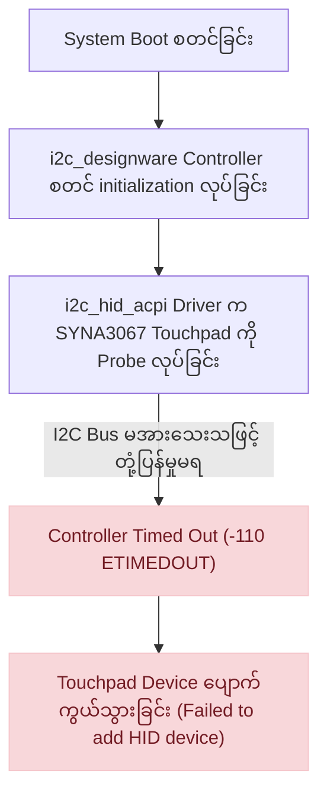
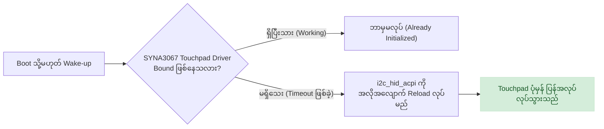

Linux (Debian / Ubuntu / Fedora) အသုံးပြုနေစဉ် Laptop ရဲ့ Touchpad က Cursor လုံးဝမလှုပ်တော့ဘဲ External USB Mouse ထိုးသုံးမှသာ အဆင်ပြေတဲ့ အခြေအနေမျိုး ကြုံဖူးကြပါလိမ့်မယ်။

ဒီတစ်ခေါက် **HP ProBook 430 G5** (Debian 13 Trixie, Linux 6.12 Kernel) မှာ ရုတ်တရက် Touchpad လုံးဝအလုပ်မလုပ်တော့တဲ့ ပြဿနာကို ကြုံတွေ့ခဲ့ရပါတယ်။ Settings ထဲမှာ Touchpad option ပျောက်နေသလို၊ `xinput` မှာလည်း ဘာမှ မပြတော့တဲ့အတွက် Hardware ချွတ်ယွင်းတာလား၊ Driver ပျောက်သွားတာလားဆိုတာကို အဆင့်ဆင့် စစ်ဆေးဖော်ထုတ်ပြီး Boot တက်ချိန်ရော Sleep/Resume မှာပါ အမြဲ အဆင်ပြေပြေ အလုပ်လုပ်နိုင်အောင် ဖြေရှင်းခဲ့တဲ့ နည်းလမ်းကို မှတ်တမ်းအဖြစ် မျှဝေပေးလိုက်ပါတယ်။


---

## ၁။ The Problem: Touchpad အလုပ်မလုပ်ခြင်းကို စစ်ဆေးခြင်း

ပထမဆုံး System က Touchpad hardware ကို မြင်/မမြင် စစ်ဆေးဖို့ `/proc/bus/input/devices` ကို ကြည့်လိုက်ပါတယ်။

```bash
cat /proc/bus/input/devices | grep -E "N: Name|H: Handlers"
```

**ရလဒ်:**
```text
N: Name="Sleep Button"
N: Name="Lid Switch"
N: Name="Power Button"
N: Name="SINO WEALTH Gaming KB "
N: Name="Logitech G102 Prodigy Gaming Mouse"
N: Name="HP WMI hotkeys"
```

အံ့ဩစရာကောင်းတာက စနစ်ထဲမှာ External Mouse (`Logitech G102`) နဲ့ External Keyboard တွေသာ မြင်နေရပြီး Laptop ရဲ့ Built-in Touchpad Device လုံးဝ ပျောက်ကွယ်နေတာ ဖြစ်ပါတယ်။

---

## ၂။ Root Cause ဖော်ထုတ်ခြင်း (Kernel Log စစ်ဆေးခြင်း)

Device node မရှိတဲ့အတွက် Kernel က Hardware ကို detect လုပ်ချိန်မှာ ဘာဖြစ်သွားလဲဆိုတာ သိရအောင် `dmesg` ကို စစ်ဆေးကြည့်ခဲ့ပါတယ်-

```bash
sudo dmesg | grep -i -E "touchpad|synaptics|elan|i2c|designware"
```

ထွက်ပေါ်လာတဲ့ Kernel log မှာ ပြဿနာရဲ့ တကယ့်တရားခံကို အောက်ပါအတိုင်း ရှင်းရှင်းလင်းလင်း တွေ့ရှိခဲ့ရပါတယ်-

```text
[    9.901790] i2c_designware i2c_designware.1: controller timed out
[    9.930651] i2c_designware i2c_designware.1: timeout in disabling adapter
[    9.930657] i2c_hid_acpi i2c-SYNA3067:00: can't add hid device: -110
[    9.930826] i2c_hid_acpi i2c-SYNA3067:00: probe with driver i2c_hid_acpi failed with error -110
```

### ဘာကြောင့် ဒီလိုဖြစ်ရသလဲ (Analysis)

1. **Hardware Architecture:** HP ProBook 430 G5 မှာ တပ်ဆင်ထားတဲ့ Touchpad ဟာ **Synaptics (`SYNA3067:00`)** အမျိုးအစားဖြစ်ပြီး Intel Sunrise Point-LP Serial IO I2C Controller ပေါ်မှာ အလုပ်လုပ်ပါတယ်။
2. **Boot Timing Race Condition:** စနစ်စတင် Boot တက်ချိန် (Boot timestamp ~9.9s) ၌ Motherboard I2C Controller (`i2c_designware`) က အပြည့်အဝ Ready မဖြစ်သေးခင် `i2c_hid_acpi` driver က Touchpad ကို စတင် ဆက်သွယ် probe လုပ်ဖို့ ကြိုးစားခဲ့ပါတယ်။
3. **Error -110 (`-ETIMEDOUT`):** I2C Controller ဆီက သတ်မှတ်ချိန်အတွင်း Response မရတဲ့အတွက် Timeout ဖြစ်သွားပြီး Kernel က Touchpad ကို Device list ထဲကနေ စွန့်လွှတ် (drop) လိုက်တာ ဖြစ်ပါတယ်။



---

## ၃။ Live Fix: Kernel Driver ကို Reload စမ်းသပ်ခြင်း

အဆိုပါပြဿနာသည် Hardware ပျက်စီးခြင်း မဟုတ်ဘဲ Boot အချိန်ကာလ တစ်ခုတည်းမှာသာ ဖြစ်ပွားသည့် Timing issue ဖြစ်ကြောင်း အတည်ပြုရန်အတွက် စနစ်အပြည့်အဝ Boot တက်ပြီးချိန်တွင် Driver Module ကို ပြန်လည် Reload လုပ်ကြည့်ခဲ့သည်-

```bash
sudo modprobe -r i2c_hid_acpi
sleep 1
sudo modprobe i2c_hid_acpi
```

Driver ပြန်တက်လာပြီးနောက် `dmesg` ကို ပြန်လည် စစ်ဆေးကြည့်ရာ-

```text
[  996.741009] input: SYNA3067:00 06CB:8265 Touchpad as /devices/pci0000:00/.../input/input34
[  996.875953] input: SYNA3067:00 06CB:8265 Touchpad as /devices/pci0000:00/.../input/input37
[  996.876791] hid-multitouch 0018:06CB:8265.0007: input,hidraw6: I2C HID v1.00 Mouse [SYNA3067:00 06CB:8265]
```

စက္ကန့်ပိုင်းအတွင်းမှာပင် Synaptics Touchpad (`06CB:8265`) ကို Kernel က Multitouch HID အဖြစ် အောင်မြင်စွာ Recognize လုပ်သွားပြီး Mouse Pointer ချက်ချင်း ပြန်လည်လှုပ်ရှား အလုပ်လုပ်လာခဲ့ပါသည်။

---

## ၄။ Permanent Solution: အလိုအလျောက် ဖြေရှင်းပေးမည့် Script နှင့် Systemd Service

ကွန်ပျူတာ Restart ချလိုက်တိုင်း သို့မဟုတ် Laptop အိပ်ရာကနိုး (Wake from sleep) တိုင်း Terminal ဖွင့်ပြီး `modprobe` လိုက်ရိုက်နေရပါက အဆင်မပြေနိုင်ပါ။ ထို့ကြောင့် စနစ်တက်လာချိန်တွင် Touchpad ချိတ်ဆက်မှု ရှိ/မရှိ စစ်ဆေးပြီး လိုအပ်ပါက အလိုအလျောက် Reload လုပ်ပေးမည့် Script နှင့် Systemd Service ကို တည်ဆောက်ခဲ့ပါသည်။



### ၁။ Detection Script တည်ဆောက်ခြင်း (`fix-touchpad.sh`)

`/usr/local/bin/fix-touchpad.sh` နေရာတွင် အောက်ပါ Script ကို ရေးသားသိမ်းဆည်းပါ-

```bash
#!/bin/bash
# ==============================================================================
# Script: fix-touchpad.sh
# Description: Checks if the Synaptics I2C touchpad is attached.
#              If the driver probe timed out during boot, it reloads i2c_hid_acpi.
# ==============================================================================

TOUCHPAD_DEVICE="i2c-SYNA3067:00"
SYSFS_PATH="/sys/bus/i2c/devices/${TOUCHPAD_DEVICE}"

# Check if the touchpad hardware device is declared in ACPI/I2C
if [ -d "${SYSFS_PATH}" ]; then
    # Check if the driver is bound
    if [ ! -d "${SYSFS_PATH}/driver" ]; then
        logger -t fix-touchpad "Touchpad (${TOUCHPAD_DEVICE}) driver not bound (probe timeout). Reloading i2c_hid_acpi..."
        /sbin/modprobe -r i2c_hid_acpi 2>/dev/null
        sleep 1
        /sbin/modprobe i2c_hid_acpi
        logger -t fix-touchpad "i2c_hid_acpi reloaded successfully."
    else
        logger -t fix-touchpad "Touchpad (${TOUCHPAD_DEVICE}) is already bound and operating."
    fi
else
    logger -t fix-touchpad "No ${TOUCHPAD_DEVICE} found in /sys/bus/i2c/devices/."
fi
```

Execution permission ပေးပါ-
```bash
sudo chmod +x /usr/local/bin/fix-touchpad.sh
```



---

### ၂။ Boot တက်ချိန်တွင် Run မည့် Systemd Service ဖန်တီးခြင်း (`fix-touchpad.service`)

Boot ပြီးဆုံးသည့်အချိန်တွင် အထက်ပါ Script ကို စစ်ဆေး run စေရန် `/etc/systemd/system/fix-touchpad.service` ဖိုင် ဖန်တီးပါ-

```ini
[Unit]
Description=Auto-fix Synaptics Touchpad I2C probe timeout on boot
After=multi-user.target

[Service]
Type=oneshot
ExecStart=/usr/local/bin/fix-touchpad.sh

[Install]
WantedBy=multi-user.target
```

Service ကို Enable လုပ်ပါ-
```bash
sudo systemctl daemon-reload
sudo systemctl enable fix-touchpad.service
```



---

### ၃။ Sleep / Suspend မှ ပြန်နိုးလာချိန်အတွက် Hook ထည့်သွင်းခြင်း (`touchpad-resume.sh`)

Laptop များတွင် သတိထားရမည့် နောက်ထပ်ပြဿနာတစ်ခုမှာ Lid ပိတ်ပြီး ပြန်ဖွင့်ချိန် (Suspend & Resume) တွင်လည်း I2C controller power state ကြောင့် Touchpad သေသွားတတ်ခြင်း ဖြစ်ပါသည်။

အဆိုပါအခြေအနေအတွက် `/lib/systemd/system-sleep/touchpad-resume.sh` ကို ဖန်တီးပေးပါ-

```bash
#!/bin/sh
case "$1" in
    post)
        /usr/local/bin/fix-touchpad.sh
        ;;
esac
```

Permission ပေးပါ-
```bash
sudo chmod +x /lib/systemd/system-sleep/touchpad-resume.sh
```



---

## ၅။ Automated One-Step Installer (`install.sh`)

အထက်ပါအဆင့်အားလုံးကို တစ်ခါတည်း အလိုအလျောက် သွင်းယူနိုင်ရန်အတွက် တစ်ခုတည်းသော Installer Script ဖြင့်လည်း ပြုလုပ်နိုင်ပါသည်-








```bash
#!/bin/bash
set -e

if [ "$EUID" -ne 0 ]; then
  echo "[-] Please run as root: sudo bash install.sh"
  exit 1
fi

SCRIPT_DIR="$(cd "$(dirname "${BASH_SOURCE[0]}")" && pwd)"

echo "[*] Installing fix-touchpad.sh to /usr/local/bin/..."
cp "${SCRIPT_DIR}/fix-touchpad.sh" /usr/local/bin/fix-touchpad.sh
chmod +x /usr/local/bin/fix-touchpad.sh

echo "[*] Installing systemd service..."
cp "${SCRIPT_DIR}/fix-touchpad.service" /etc/systemd/system/fix-touchpad.service
systemctl daemon-reload
systemctl enable fix-touchpad.service

echo "[*] Installing suspend/resume sleep hook..."
mkdir -p /lib/systemd/system-sleep
cp "${SCRIPT_DIR}/touchpad-resume.sh" /lib/systemd/system-sleep/touchpad-resume.sh
chmod +x /lib/systemd/system-sleep/touchpad-resume.sh

echo "[*] Executing fix-touchpad.sh now..."
/usr/local/bin/fix-touchpad.sh

echo "[+] Installation complete! Touchpad will automatically recover across reboots and sleep."
```

---

## ၆။ စစ်ဆေးအတည်ပြုခြင်း (Verification)

Service လုပ်ဆောင်ချက် မှန်ကန်မှု ရှိ/မရှိကို System Log ဖြင့် စစ်ဆေးကြည့်နိုင်သည်-

```bash
sudo journalctl -t fix-touchpad -n 10
```

**Output:**
```text
Sep 15 04:32:35 debian fix-touchpad[7582]: Touchpad is already initialized.
```

အကယ်၍ Boot တက်ချိန်၌ Error -110 ဖြင့် Driver ပြုတ်ကျကျန်ခဲ့ပါက Script က ချက်ချင်း Reload လုပ်ပေးမည်ဖြစ်ပြီး အကယ်၍ ပုံမှန်အတိုင်း အဆင်ပြေနေပါက မလိုအပ်ဘဲ ထပ်မံ Reload လုပ်မည် မဟုတ်ပါ။

GNOME Wayland Input Settings တွင်လည်း Touchpad ကို Multi-touch Gestures (Two-finger scroll, Tap to click) အပြည့်အစုံဖြင့် ပုံမှန်အတိုင်း ချောမွေ့စွာ ပြန်လည် အသုံးပြုနိုင်ပြီ ဖြစ်ပါသည်။

---

## အကျဉ်းချုပ် (Takeaways)

- Linux တွင် Laptop Touchpad အလုပ်မလုပ်ပါက Hardware ချို့ယွင်းသည်ဟု ချက်ချင်း မယူဆပါနှင့်။ `cat /proc/bus/input/devices` နှင့် `dmesg | grep -iE "touchpad|i2c"` ကို အရင် စစ်ဆေးပါ။
- ခေတ်မီ Laptop အများစု (HP ProBook, ThinkPad, Dell XPS) တွင် Touchpad များသည် PS/2 မဟုတ်တော့ဘဲ **I2C Bus** ဖြင့် ချိတ်ဆက်ထားသောကြောင့် Boot time race condition ကြောင့် `-110 ETIMEDOUT` ဖြစ်တတ်ပါသည်။
- ယာယီဖြေရှင်းရန် `modprobe -r i2c_hid_acpi && modprobe i2c_hid_acpi` ဖြင့် ချက်ချင်း စမ်းသပ်နိုင်ပြီး၊ အမြဲတမ်းအတွက် `systemd` oneshot service နှင့် `system-sleep` hook တို့ကို အသုံးပြုကာ စိတ်ချလက်ချ အလိုအလျောက် ပြုပြင်ထားနိုင်ပါသည်။
