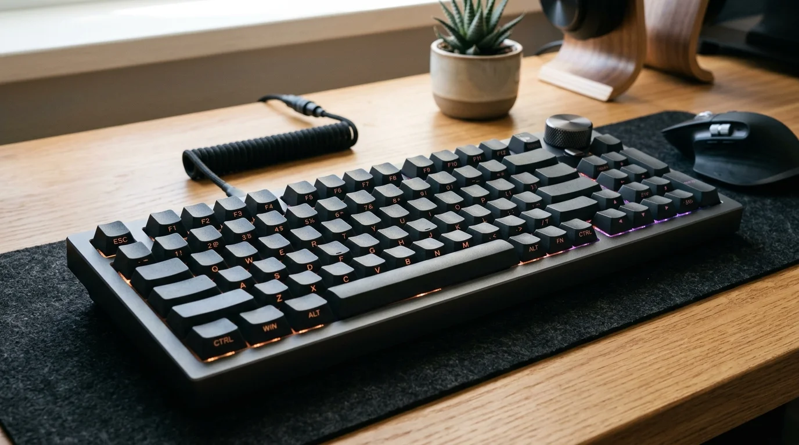

မကြာသေးခင်က ကျွန်တော့်ရဲ့ Desktop စားပွဲတင် Setup အသစ်အတွက် HXSJ T90 Mouse နဲ့ တွဲဖက်သုံးဖို့ ကြိုးမဲ့ Keyboard တစ်လုံး ရှာဖြစ်ခဲ့ပါတယ်။ အဲဒီအချိန်မှာ ပုံမှန်တွေ့နေကျ Keyboard တွေနဲ့ မတူဘဲ ထူးထူးခြားခြား စပီကာ Built-in ပါဝင်ပြီး စာရိုက်တိုင်း အသံထွက်ပေးနိုင်တဲ့ **Furycube IP98S Pro Music Keyboard** ကို စမ်းသပ်ဝယ်ယူဖြစ်ခဲ့ပါတယ်။

ဒီဆောင်းပါးမှာတော့ IP98S Pro ကို စတင်အသုံးပြုချိန်မှာ ရရှိခဲ့တဲ့ အတွေ့အကြုံ၊ စပီကာ အသံထွက် စနစ်တွေနဲ့ 98-Key Layout အသုံးပြုရပုံတွေကို မျှဝေပေးသွားပါမယ်။

---

## ၁။ Built-in Speaker နဲ့ ထူးခြားတဲ့ အသံထွက် လုပ်ဆောင်ချက်များ

Furycube IP98S Pro ရဲ့ အဓိက ဆွဲဆောင်မှုအရှိဆုံး အချက်ကတော့ Keyboard ရဲ့ ကိုယ်ထည်ထဲမှာ **သီးသန့် စပီကာ (Speaker)** တပ်ဆင်ထားတာ ဖြစ်ပါတယ်။

ပုံမှန် Mechanical Keyboard တွေဟာ Switch ရဲ့ စက်ပိုင်းဆိုင်ရာ ကလစ်သံထွက်တာ ဖြစ်ပေမဲ့ ဒီ IP98S Pro ကတော့ ခလုတ်တစ်ခုချင်းစီကို နှိပ်လိုက်တိုင်း စပီကာကနေ အသံလှလှလေးတွေ တိုက်ရိုက် မြည်ပေးတာ ဖြစ်ပါတယ်။

### ပါဝင်တဲ့ အသံအမျိုးအစား ၆ မျိုး

1. **စန္ဒရားသံ (Piano Notes):** စာရိုက်ရင်း သီချင်းတီးနေရသလို ခံစားချက်မျိုး ပေးပါတယ်။
2. **လက်နှိပ်စက်သံ (Typewriter):** ရှေးဟောင်း လက်နှိပ်စက်သံလို တဖျစ်ဖျစ် မြည်သံ ထွက်ပါတယ်။
3. **ရေစက်သံ (Water Drop):** စိတ်အေးချမ်းစေတဲ့ ရေစက်ကျသံ ပုံစံ ဖြစ်ပါတယ်။
4. **ဘဲအော်သံ (Quacking Duck):** အပျော်သဘော ရယ်စရာကောင်းတဲ့ ဘဲအော်သံ ထွက်ပါတယ်။
5. **ဂိမ်းအသံ (Game Bubble):** ဂန္ထဝင် Retro Game တွေထဲကလို Bubble ပေါက်သံ ဖြစ်ပါတယ်။
6. **နှင်းနင်းသံ (Snow Crunch):** နှင်းခဲပေါ် ခြေနင်းသွားသလို ဂျွတ်ဂျွတ်မြည်သံ ထွက်ပါတယ်။

### အသံပြောင်းလဲနည်းနဲ့ အသံပိတ်နည်း

Keyboard ရဲ့ အသံ Mode တွေကို ပြောင်းလဲဖို့ သို့မဟုတ် လုံးဝ အသံပိတ်ဖို့အတွက် Shortcut တစ်ခုတည်းနဲ့ လွယ်လွယ်ကူကူ ထိန်းချုပ်နိုင်ပါတယ်-

* **`FN + V` နှိပ်ပါ:** အသံ Mode တွေကို တစ်ခုပြီးတစ်ခု အလှည့်ကျ ပြောင်းလဲပေးသွားပါမယ်။
* **အသံပိတ်လိုလျှင်:** `FN + V` ကို အသံမထွက်တော့တဲ့ အခြေအနေရောက်တဲ့အထိ အဆင့်ဆင့် နှိပ်ပြီး အသံလုံးဝ ပိတ်ထားနိုင်ပါတယ်။ ညဘက် စာရိုက်ချိန် ဒါမှမဟုတ် ရုံးခန်းထဲမှာ တိတ်တိတ်ဆိတ်ဆိတ် သုံးချင်ရင် အသံပိတ်ထားလို့ ရပါတယ်။

---

## ၂။ Membrane Feel နဲ့ စာရိုက်ရတဲ့ ခံစားချက်

IP98S Pro ဟာ Mechanical Keyboard အစစ်မဟုတ်ဘဲ **Membrane (ရော်ဘာခလုတ် အခံ)** နည်းပညာကို အခြေခံပြီး Mechanical ပုံစံ ဖန်တီးထားတာ ဖြစ်ပါတယ်။

* **နူးညံ့ငြိမ့်ညောင်းမှု:** Mechanical Switch တွေလို တင်းမာမှု မရှိဘဲ လက်ချောင်းလေးတွေနဲ့ ပေါ့ပေါ့ပါးပါး ဖိနှိပ်ရိုက်ကူးနိုင်ပါတယ်။
* **တိတ်ဆိတ်မှု:** စပီကာ အသံကို ပိတ်ထားလိုက်ရင် အလွန်တိတ်ဆိတ်တဲ့ Silent Keyboard အဖြစ် ပြောင်းလဲသွားတာကြောင့် ဘေးလူကို အနှောင့်အယှက် မဖြစ်စေပါဘူး။
* **Side-Printed PBT Keycaps:** အပေါ်မျက်နှာပြင်မှာ စာသားမပါဘဲ ပြောင်ရှင်းနေပြီး ခလုတ်တွေရဲ့ အရှေ့ဘက် မျက်နှာစာ (Side-printed) မှာ စာလုံးတွေ ထွင်းထုထားတာ ဖြစ်ပါတယ်။ အောက်ဘက်က ထွက်လာတဲ့ RGB မီးရောင်နဲ့ ပေါင်းစပ်လိုက်တဲ့အခါ အလွန်သပ်ရပ်ပြီး ခေတ်မီတဲ့ Aesthetic ခံစားချက်ကို ပေးပါတယ်။

---

## ၃။ 98-Key Layout နဲ့ Multifunctional Knob အသုံးပြုပုံ

ဒီ Keyboard ဟာ စားပွဲပေါ်မှာ နေရာအများကြီး မယူတဲ့ **98-Key Compact Layout** ဖြစ်ပါတယ်။

* **Numpad ပါဝင်ခြင်း:** စာရင်းဇယားနဲ့ ဂဏန်းတွေ အများကြီး ရိုက်ရသူတွေအတွက် သီးသန့် Numpad အပြည့်အစုံ ပါဝင်တာကြောင့် အဆင်ပြေပါတယ်။
* **Multifunctional Rotary Knob ထိန်းချုပ်မှု:** ညာဘက် အပေါ်ထောင့်မှာ သတ္တုလုံးပတ်ခလုတ် (Rotary Knob) လေး ပါဝင်ပါတယ်။ သတိပြုရမယ့် အချက်ကတော့ ဒီ Knob လေးကို သာမန်အတိုင်း လှည့်ရုံသက်သက်နဲ့ အလုပ်မလုပ်ဘဲ **`Fn` Key နဲ့ တွဲဖက်ပြီး အသုံးပြုရတာ** ဖြစ်ပါတယ်-
  * **`Fn + Knob လှည့်ခြင်း`:** ကွန်ပျူတာရဲ့ အသံအတိုးအကျယ် (Volume) ကို လျှင်မြန်စွာ ချိန်ညှိနိုင်ပါတယ်။
  * **`Fn + Knob နှိပ်ခြင်း (Click)`:** အသံကို တစ်ချက်တည်းနဲ့ Mute လုပ်တာ သို့မဟုတ် မီးရောင် အလင်းအမှောင် စနစ်တွေကို ပြောင်းလဲနိုင်ပါတယ်။

---

## ၄။ Tri-Mode ကြိုးမဲ့ ချိတ်ဆက်မှု၊ Linux သုံးစွဲပုံနဲ့ အသုံးဝင် Shortcut များ

ချိတ်ဆက်မှုအတွက် Mode သုံးမျိုးစလုံး ပါဝင်ပါတယ်-
* **2.4GHz Wireless:** USB Receiver Dongle နဲ့ Latency အနည်းဆုံး ချိတ်ဆက်နိုင်ပါတယ်။
* **Bluetooth:** စက်ပစ္စည်းမျိုးစုံ (Laptop, iPad, ဖုန်း) နဲ့ တွဲဖက်သုံးနိုင်ပါတယ်။
* **Type-C Wired:** ကြိုးထိုးပြီး သုံးရင်း 4000mAh Battery ကို အားသွင်းနိုင်ပါတယ်။

### Linux စနစ်မှာ အသုံးပြုပုံ (Linux Compatibility)

Linux (Ubuntu, Debian, Fedora, Arch စတာတွေ) မှာ အသုံးပြုတဲ့အခါ **`FN + A` (PC Mode)** အနေအထားနဲ့ တိုက်ရိုက် အသုံးပြုနိုင်ပါတယ်။
* `Win` Key ဟာ Linux ရဲ့ `Super` / Meta Key အဖြစ် အလိုအလျောက် အလုပ်လုပ်ပေးတာကြောင့် Application Launcher ကို လျင်မြန်စွာ ခေါ်ယူနိုင်ပါတယ်။
* `Alt` Key ကလည်း `Alt + Tab` သို့မဟုတ် Terminal ခေါ်တဲ့ Shortcut (`Ctrl + Alt + T`) တွေနဲ့ ချောချောမောမော အလုပ်လုပ်ပါတယ်။
* Driver သီးသန့် ထည့်သွင်းစရာ မလိုဘဲ Bluetooth (BlueZ)၊ 2.4G Dongle နဲ့ Type-C Wired အားလုံးဟာ Linux Kernel ထဲမှာ Native အတိုင်း အဆင်ပြေပြေ သုံးနိုင်ပါတယ်။

### ပျောက်နေတဲ့ Keys များ သုံးစွဲနည်း (Screenshot, Home, End)

98-Key Compact Keyboard တွေမှာ နေရာချွေတာထားတာကြောင့် Full-size Keyboard တွေလို သီးသန့်ခလုတ် မပါဝင်တဲ့ Keys တွေကို အောက်ပါအတိုင်း လွယ်ကူစွာ သုံးနိုင်ပါတယ်-

1. **Screenshot (Screen Capture / PrintScreen):**
   ဒီ Keyboard မှာ `FN + F5` ကနေ `FN + F8` အထိ ခလုတ်တွေကို **Music / Media Control** (သီချင်း ဖွင့်/ပိတ်၊ အပုဒ်ကျော်ခြင်း) အတွက် မူလကတည်းက သီးသန့် သတ်မှတ်ထားတာ ဖြစ်ပါတယ်။ ဒါကြောင့် သီချင်းထိန်းချုပ်မှုတွေကို မထိခိုက်စေဘဲ Screenshot ရိုက်ကူးဖို့ အကောင်းဆုံး နည်းလမ်းတွေကတော့-
   * **Linux Desktop Shortcut:** Linux (GNOME / Ubuntu / Fedora စတာတွေ) မှာ `Super + Shift + S` နဲ့ မျက်နှာပြင် ဖြတ်ယူတဲ့ Interactive Screenshot Tool ကို အလွယ်တကူ ခေါ်ယူနိုင်ပါတယ်။
   * **Flameshot သုံးစွဲသူများအတွက် (Linux):** အကယ်၍ Flameshot သုံးပါက Linux ရဲ့ `Settings → Keyboard → View and Customize Shortcuts` ထဲက Custom Shortcut မှာ `flameshot gui` ကို `Super + Shift + S` (ဒါမှမဟုတ် `Ctrl + Alt + S`) လို့ သတ်မှတ်ထားနိုင်ပါတယ်။
   * **Windows Shortcut:** Windows ပေါ်မှာတော့ `Win + Shift + S` နဲ့ စာမျက်နှာကို လိုသလို ချက်ချင်း ဖြတ်ယူနိုင်ပါတယ်။
   * **Keyboard Shortcut:** အကယ်၍ Keyboard ပေါ်ကနေ တိုက်ရိုက် ရိုက်ချင်ပါက `FN + P` (PrintScreen) ကို စမ်းသပ် သုံးစွဲနိုင်ပါတယ်။
2. **Home နဲ့ End Keys သုံးစွဲနည်း:**
   * **နည်းလမ်း (၁) Numpad Navigation စနစ်:** အလွယ်ကူဆုံး နည်းလမ်းကတော့ **`NumLock` ခလုတ်ကို တစ်ချက်နှိပ်ပြီး မီးပိတ်လိုက်တာ** ဖြစ်ပါတယ်။
     * Numpad `7` = **Home** (စာကြောင်း အစသို့ ရွှေ့ခြင်း)
     * Numpad `1` = **End** (စာကြောင်း အဆုံးသို့ ရွှေ့ခြင်း)
     * Numpad `9` = **Page Up (PgUp)**
     * Numpad `3` = **Page Down (PgDn)**
     * (ဂဏန်းတွေ ပြန်ရိုက်ချင်တဲ့အခါ `NumLock` ကို ပြန်ဖွင့်ရုံပါပဲ)။
   * **နည်းလမ်း (၂) Arrow Key နဲ့ Terminal Shortcuts:**
     * စာကြောင်းအစသို့ ရွှေ့ဖို့ `FN + ဘယ်မျှား (←)` ဒါမှမဟုတ် Linux Terminal/Bash ထဲမှာ `Ctrl + A` (Home)။
     * စာကြောင်းအဆုံးသို့ ရွှေ့ဖို့ `FN + ညာမျှား (→)` ဒါမှမဟုတ် Linux Terminal/Bash ထဲမှာ `Ctrl + E` (End)။

### Factory Reset ပြုလုပ်နည်း (Keyboard Reset)

ခလုတ်တွေ အလုပ်မလုပ်တော့တာ၊ ချိတ်ဆက်မှု မငြိမ်တာ သို့မဟုတ် မူလစက်ရုံထုတ် အခြေအနေအတိုင်း အစကနေ ပြန်လည် သတ်မှတ်ချင်တဲ့အခါ-
* **`FN + ESC`** ကို **၃ စက္ကန့်ကနေ ၅ စက္ကန့်ခန့်** မီးအားလုံး မြန်မြန် မှိတ်တုတ်မှိတ်တုတ် ဖြစ်သွားတဲ့အထိ ဖိထားပေးပါ။ ကီးဘုတ်ရဲ့ မူလ Setting တွေအားလုံး အောင်မြင်စွာ Reset ဖြစ်သွားပါမယ်။

### Win Key နဲ့ Alt Key နေရာလွဲသွားခြင်း ဖြေရှင်းနည်း

စာရိုက်နေရင်း `Win` (Windows/Super) Key နှိပ်မရတော့ဘဲ `Alt` Key နေရာ ရောက်သွားတာ (သို့မဟုတ် Win နဲ့ Alt နေရာချင်း လဲသွားတာ) ဟာ Keyboard က **Mac Mode (`FN + W`)** ထဲ အမှတ်တမဲ့ ရောက်သွားလို့ ဖြစ်ပါတယ်။ Mac OS မှာ Command Key က Spacebar ဘေးနားမှာ ရှိတာကြောင့် Keyboard က နေရာချင်း အလိုအလျောက် လဲပေးလိုက်တာ ဖြစ်ပါတယ်။

* **ပြန်လည်ပြင်ဆင်နည်း:** **`FN + A`** ကို တစ်ချက် နှိပ်ပေးလိုက်ရုံပါပဲ။ Windows / Linux (PC Mode) ဆီ ချက်ချင်း ပြန်ရောက်သွားပြီး Win နဲ့ Alt ခလုတ်တွေ မူလနေရာအတိုင်း အလုပ်ပြန်လုပ်ပါမယ်။
* **Win Key လုံးဝ နှိပ်မရဘဲ Lock ကျနေလျှင်:** ဂိမ်းကစားချိန် အမှတ်တမဲ့ မထွက်သွားစေဖို့ Win Key ကို Lock ချထားတဲ့ စနစ် ဖြစ်ပါတယ်။ **`FN + Win`** ကို နှိပ်ပြီး Windows Key Lock ကို ပြန်ဖွင့်နိုင်ပါတယ်။

### အသုံးဝင်တဲ့ Shortcut ဇယားချုပ်

| Shortcut | လုပ်ဆောင်ချက် |
| :--- | :--- |
| **`FN + A`** | Windows / Linux (PC) စနစ်သို့ ပြောင်းခြင်း (Win နဲ့ Alt နေရာလွဲတာ ပြန်ပြင်ရန်) |
| **`FN + W`** | Mac / macOS စနစ်သို့ သတ်မှတ်ခြင်း |
| **`FN + Win`** | Windows Key Lock (Win Key ပိတ်ခြင်း / ပြန်ဖွင့်ခြင်း) |
| **`FN + ESC` (၃ စက္ကန့် ဖိထားပါ)** | Factory Reset (မူလ စက်ရုံထုတ် အခြေအနေသို့ ပြန်လည် သတ်မှတ်ခြင်း) |
| **`FN + Rotary Knob`** | Volume အသံအတိုးအကျယ် ချိန်ညှိခြင်း / Mute ပြုလုပ်ခြင်း |
| **`FN + V`** | စပီကာ အသံထွက် Mode ပြောင်းလဲခြင်း သို့မဟုတ် အသံပိတ်ခြင်း |
| **`FN + F5 ~ F8`** | Music / Media Controls (သီချင်း ဖွင့်/ပိတ်၊ အပုဒ်ကျော်ခြင်း) |
| **`Super / Win + Shift + S`** | Screenshot (Linux / Windows မျက်နှာပြင် ဖြတ်ယူခြင်း) |
| **`NumLock` ပိတ်ပြီး `7` / `1`** | Home Key (`7`) နဲ့ End Key (`1`) သုံးစွဲခြင်း |
| **`FN + Insert`** | RGB မီးရောင်ပုံစံ (Lighting Effects) ပြောင်းလဲခြင်း |

---

## ၅။ အားသာချက်နဲ့ သတိပြုစရာ အချက်များ

| အားသာချက်များ (Pros) | သတိပြုစရာ အချက်များ (Cons) |
| :--- | :--- |
| စပီကာ Built-in ပါဝင်ပြီး အသံစုံ ရွေးချယ်နိုင်ခြင်း | Mechanical Switch အစစ် မဟုတ်ဘဲ Membrane အခြေခံဖြစ်ခြင်း |
| Numpad ပါဝင်တဲ့ Compact 98-Key Layout ဖြစ်ခြင်း | စပီကာအသံ အမြဲဖွင့်ထားရင် Battery ပိုမို ကုန်မြန်နိုင်ခြင်း |
| Side-Printed Keycaps နဲ့ သပ်ရပ်လှပတဲ့ ဒီဇိုင်းဖြစ်ခြင်း | Rotary Knob ကို သုံးဖို့ FN Key နဲ့ တွဲဖက်လှည့်ရခြင်း |
| အသံပိတ်ထားချိန်မှာ အလွန်တိတ်ဆိတ်စွာ စာရိုက်နိုင်ခြင်း | Hot-swap Switch အပြောင်းအလဲ လုပ်မရခြင်း |

---

## နိဂုံးချုပ် သုံးသပ်ချက်

ခြုံပြီး ပြောရရင် **Furycube IP98S Pro Keyboard** ဟာ စာရိုက်ရတာ ပျင်းရိမနေစေဘဲ အသစ်အဆန်း အတွေ့အကြုံကို လိုချင်သူတွေအတွက် အလွန်ဆွဲဆောင်မှုရှိတဲ့ Keyboard တစ်ခု ဖြစ်ပါတယ်။

ပုံမှန်အလုပ်လုပ်ချိန်မှာ တိတ်ဆိတ်တဲ့ Membrane အဖြစ် သုံးနိုင်သလို၊ စိတ်ပြေလက်ပျောက် အပန်းဖြေချင်တဲ့အခါ စန္ဒရားသံ၊ လက်နှိပ်စက်သံလေးတွေ ဖွင့်ပြီး စာရိုက်နိုင်တာက သူ့ရဲ့ မတူကွဲပြားတဲ့ စတိုင်လ်တစ်ခု ဖြစ်ပါတယ်။ စားပွဲတင် Setup မှာ ထူးထူးခြားခြားနဲ့ အဆင်ပြေပြေ သုံးချင်သူတွေ စမ်းသပ်ကြည့်ဖို့ တန်ဖိုးရှိတဲ့ Gadget တစ်ခု ဖြစ်ပါတယ်။
