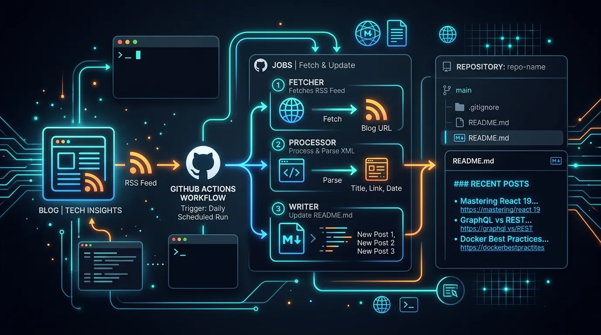
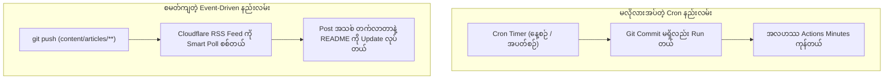

GitHub Profile README ဒါမှမဟုတ် ကိုယ်ပိုင် Open Source Project ရဲ့ README ထဲမှာ ကိုယ်ရေးထားတဲ့ နောက်ဆုံးထွက် Blog Post တွေကို အလိုအလျောက် ဖော်ပြပေးနိုင်တဲ့ GitHub Action တစ်ခုကတော့ [gautamkrishnar/blog-post-workflow](https://github.com/gautamkrishnar/blog-post-workflow) ဖြစ်ပါတယ်။

ဒီ Action က ကိုယ့်ရဲ့ Blog RSS Feed ကို လှမ်းဆွဲပြီး README ထဲက Tag ကြားမှာ Post ခေါင်းစဉ်နဲ့ Link တွေကို အလိုအလျောက် ဖြည့်ပေးတာပါ။ ဒါပေမဲ့ သူ့ရဲ့ Official Documentation မှာ ပေးထားတဲ့ နမူနာက အချိန်အပိုင်းအခြားအလိုက် အမြဲတမ်း ပုံမှန် run နေတဲ့ Cron Schedule (`cron: '0 0 * * *'`) ကို အသုံးပြုထားပါတယ်။

ဒီဆောင်းပါးမှာတော့ Static Site တစ်ခုအတွက် အကျိုးမရှိတဲ့ Cron Run တွေနဲ့ GitHub Actions Runner Minutes တွေ အလဟဿမဖြစ်စေဘဲ၊ Content အသစ် Push လုပ်တဲ့အချိန်မှသာ Cloudflare Deployment ကို စစ်ဆေးပြီး README ကို Auto Update လုပ်တဲ့ စမတ်ကျတဲ့ နည်းလမ်းကို လက်တွေ့ မျှဝေပေးသွားပါမယ်။



---

## ၁။ Cron Schedule ရဲ့ ပြဿနာနဲ့ Event-Driven အယူအဆ

`blog-post-workflow` က Medium, Dev.to ဒါမှမဟုတ် WordPress လိုမျိုး GitHub ပြင်ပမှာ ရေးထားတဲ့ Blog တွေအတွက် ရည်ရွယ်ပြီး Cron Job ကို အကြံပြုထားတာ ဖြစ်ပါတယ်။ အဲဒီလို ပြင်ပ Platform တွေက ဘယ်အချိန် Post အသစ် တင်လိုက်သလဲဆိုတာ GitHub ဘက်က ကြိုမသိနိုင်တာကြောင့် နေ့စဉ် ဒါမှမဟုတ် အပတ်စဉ် စစ်ဆေးနေရတာ ဖြစ်ပါတယ်။

ဒါပေမဲ့ ကျွန်တော်တို့ရဲ့ Hugo Blog က ဒီ GitHub Repository ထဲမှာပဲ ရှိနေတာပါ။ ဆိုလိုတာက ကျွန်တော်တို့ `content/articles/` ထဲမှာ Article အသစ်တစ်ခု Commit လုပ်ပြီး `main` branch ဆီ Push မလုပ်မချင်း Website မှာ Content အသစ် လုံးဝ ထွက်လာမှာ မဟုတ်ပါဘူး။



ဒီတော့ နေ့စဉ် cron run နေတာကို ဖြုတ်ပြီး GitHub Actions ရဲ့ `paths` filter နဲ့ ပြောင်းလဲလိုက်ရင် အလဟဿ ဖြစ်နေတဲ့ workflow run တွေကို အကုန်လုံး ဖယ်ရှားနိုင်သွားပါတယ်။

---

## ၂။ ကြုံရတတ်တဲ့ Deployment Latency အခက်အခဲ

Cron ကို ဖြုတ်ပြီး `push: paths: ['content/articles/**']` လို့ ပြောင်းလိုက်တာနဲ့ ချက်ချင်း အလုပ်ဖြစ်သွားပြီလားဆိုတော့ သတိထားရမယ့် အချက်တစ်ခု ရှိပါသေးတယ်။

GitHub ဆီ Commit တစ်ခု Push လုပ်လိုက်တာနဲ့ Cloudflare Pages / Workers က သူ့ဘက်မှာ Website ကို စတင် Build လုပ်ပြီး Edge Network ဆီ Deploy လုပ်ဖို့ အနည်းဆုံး **၁ မိနစ်ကနေ ၂ မိနစ်ဝန်းကျင်** ကြာတတ်ပါတယ်။

အကယ်၍ ကျွန်တော်တို့ရဲ့ GitHub Action က Push ဖြစ်တာနဲ့ ချက်ချင်း run ပြီး `https://hhk.my.id/articles/index.xml` ကို လှမ်းဆွဲလိုက်မယ်ဆိုရင် Cloudflare ဘက်မှာ Build မပြီးသေးတဲ့အတွက် RSS feed ထဲမှာ Post အသစ် ပါမလာသေးပါဘူး။ အဲဒီအခါ README မှာ Post အဟောင်းတွေပဲ ပြန်ပေါ်နေတတ်ပါတယ်။

---

## ၃။ Smart Deployment Polling ဖြေရှင်းနည်း

ဒီပြဿနာကို ဖြေရှင်းဖို့ Cloudflare API Token တွေ၊ Account ID တွေ ရှာထည့်နေစရာ မလိုပါဘူး။ Runner ထဲမှာပဲ Bash script လေးနဲ့ အခု Push လိုက်တဲ့ Article ရဲ့ Slug ကို ရယူပြီး Live RSS feed ထဲမှာ အဲဒီ Slug ပါလာပြီလားဆိုတာကို ၁၀ စက္ကန့်တစ်ခါ လှမ်းစစ်ပေးတဲ့ Polling Logic ကို ထည့်သွင်းလိုက်တာ အကောင်းဆုံး ဖြစ်ပါတယ်။

```bash
FEED_URL="https://hhk.my.id/articles/index.xml"
LATEST_SLUG=$(git log -1 --name-only -- 'content/articles/**/index.md' | grep -E '^content/articles/[^/]+/index\.md' | head -n 1 | cut -d'/' -f3 || true)

if [[ -z "$LATEST_SLUG" ]]; then
  echo "No specific article slug detected in the latest commit. Proceeding directly..."
  exit 0
fi

echo "Waiting for article '$LATEST_SLUG' to appear in $FEED_URL..."
for i in {1..30}; do
  if curl -s "$FEED_URL" | grep -q "/article/${LATEST_SLUG}/"; then
    echo "Article is live on Cloudflare! Proceeding with README update..."
    exit 0
  fi
  echo "Not live yet. Waiting 10 seconds... (attempt $i/30)"
  sleep 10
done

echo "Timed out waiting for article to appear in live RSS feed."
exit 1
```

ဒီ Script ရဲ့ အားသာချက်တွေကတော့ -
1. **API Key မလိုခြင်း:** Cloudflare ဘက်က Token ဒါမှမဟုတ် Secret တွေ GitHub ထဲ ထည့်ထားစရာ မလိုပါဘူး။
2. **Edge Cache သေချာပေါက် ကင်းစင်ခြင်း:** Cloudflare API က Build ပြီးပြီလို့ ပြောပေမယ့် CDN Cache ကျန်နေသေးရင် Feed က အဟောင်းပဲ လာနေနိုင်ပါတယ်။ ဒီနည်းက တကယ့် Live Feed ကို တိုက်ရိုက် စစ်တာဖြစ်လို့ ၁၀၀% သေချာပါတယ်။
3. **အချိန်မဖြုန်းခြင်း:** Fixed sleep (ဥပမာ `sleep 120`) လိုမျိုး အကြာကြီး ထိုင်စောင့်မနေဘဲ Cloudflare က ၄၅ စက္ကန့်နဲ့ ပြီးသွားရင် ချက်ချင်း ဆက် run သွားပါတယ်။

---

## ၄။ လက်တွေ့ တပ်ဆင်အသုံးပြုနည်း

### အဆင့် (၁) - README.md ထဲမှာ Comment Tag ထည့်သွင်းခြင်း

ကိုယ် ပြသချင်တဲ့ README ဖိုင် (ဥပမာ `.github/README.md`) ထဲမှာ အောက်ပါ Tag နှစ်ခုကို ထည့်ပေးရပါမယ်။ Action run တဲ့အခါ ဒီ Tag နှစ်ခုကြားထဲမှာ List ကို အလိုအလျောက် ထည့်သွင်းပေးသွားမှာ ဖြစ်ပါတယ်။

```markdown
## Recent Articles

<!-- BLOG-POST-LIST:START -->
<!-- BLOG-POST-LIST:END -->
```

### အဆင့် (၂) - Workflow File ဖန်တီးခြင်း

`.github/workflows/blog-post-workflow.yml` ဖိုင်ကို အောက်ပါအတိုင်း ရေးသားလိုက်ပါတယ် -

```yaml
name: Update Recent Articles in README

on:
  push:
    branches:
      - main
    paths:
      - "content/articles/**"
  workflow_dispatch:

permissions:
  contents: write

concurrency:
  group: blog-post-${{ github.ref }}
  cancel-in-progress: true

jobs:
  update-readme-with-blog:
    name: Update README with latest blog posts
    runs-on: ubuntu-latest
    steps:
      - name: Checkout repository
        uses: actions/checkout@v4
        with:
          fetch-depth: 2

      - name: Wait for Cloudflare deployment in RSS feed
        shell: bash
        run: |
          FEED_URL="https://hhk.my.id/articles/index.xml"
          LATEST_SLUG=$(git log -1 --name-only -- 'content/articles/**/index.md' | grep -E '^content/articles/[^/]+/index\.md' | head -n 1 | cut -d'/' -f3 || true)

          if [[ -z "$LATEST_SLUG" ]]; then
            echo "No specific article slug detected in the latest commit. Proceeding directly..."
            exit 0
          fi

          echo "Waiting for article '$LATEST_SLUG' to appear in $FEED_URL..."
          for i in {1..30}; do
            if curl -s "$FEED_URL" | grep -q "/article/${LATEST_SLUG}/"; then
              echo "Article is live on Cloudflare! Proceeding with README update..."
              exit 0
            fi
            echo "Not live yet. Waiting 10 seconds... (attempt $i/30)"
            sleep 10
          done

          echo "Timed out waiting for article to appear in live RSS feed."
          exit 1

      - name: Update README with blog posts
        uses: gautamkrishnar/blog-post-workflow@v1
        with:
          feed_list: "https://hhk.my.id/articles/index.xml"
          readme_path: "./.github/README.md"
          max_post_count: 5
          enable_keepalive: false
          committer_username: "github-actions[bot]"
          committer_email: "41898282+github-actions[bot]@users.noreply.github.com"
          commit_message: "docs(readme): update recent articles list"
```

---

## ၅။ သတိပြုသင့်တဲ့ အရေးကြီး Configuration အချက်များ

1. **`feed_list` အတွက် Article သီးသန့် RSS ကို သုံးပါ:**
   Site Root ရဲ့ `index.xml` ကို သုံးမယ့်အစား `https://hhk.my.id/articles/index.xml` ကို သုံးလိုက်တာကြောင့် About, License ဒါမှမဟုတ် Store လိုမျိုး Static Page တွေ မပါလာဘဲ Blog Article အစစ်တွေကိုပဲ သီးသန့် ရွေးထုတ်ပေးနိုင်ပါတယ်။

2. **`enable_keepalive: false` သတ်မှတ်ပါ:**
   Action ရဲ့ မူလ Default က Repo မအိပ်ပျော်သွားစေဖို့ Dummy Commit တွေ လိုက်ထည့်တဲ့ Keepalive ပါဝင်ပါတယ်။ ကျွန်တော်တို့က Git Commit History ကို သန့်ရှင်းသပ်ရပ်စွာ ထိန်းသိမ်းချင်တာကြောင့် `false` ထားပေးဖို့ လိုအပ်ပါတယ်။

3. **`concurrency` ထိန်းချုပ်ပါ:**
   ဆောင်းပါးအသစ် တင်ပြီးပြီးချင်း နောက်ထပ် Commit တွေ ထပ်ပိုး Push လုပ်မိတဲ့အခါ Workflow အချင်းချင်း README ကို Conflict မဖြစ်စေဘဲ နောက်ဆုံးတစ်ခုတည်းကိုသာ ဦးစားပေး အလုပ်လုပ်စေဖို့ `cancel-in-progress: true` ကို အသုံးပြုထားပါတယ်။

---

## နိဂုံး

ဒီလို စနစ်တကျ ပြင်ဆင်လိုက်တဲ့အခါ မလိုအပ်ဘဲ နေ့စဉ် run နေတဲ့ Cron Job တွေ မရှိတော့သလို၊ ဆောင်းပါးအသစ် ရေးပြီး `git push` လုပ်လိုက်တာနဲ့ Cloudflare ပေါ် တကယ် ရောက်မရောက်ကို စောင့်ကြည့်ပြီးမှ README ကို Auto Update လုပ်ပေးသွားမှာ ဖြစ်ပါတယ်။ 

GitHub Actions Runner Minutes တွေကိုလည်း ထိန်းသိမ်းပြီးသား ဖြစ်သလို ပြင်ပ API Token တွေ မလိုဘဲ အားလုံးကို Repository အတွင်းမှာတင် သပ်သပ်ရပ်ရပ် ပြီးပြည့်စုံအောင် တည်ဆောက်နိုင်သွားတာ ဖြစ်ပါတယ်။
