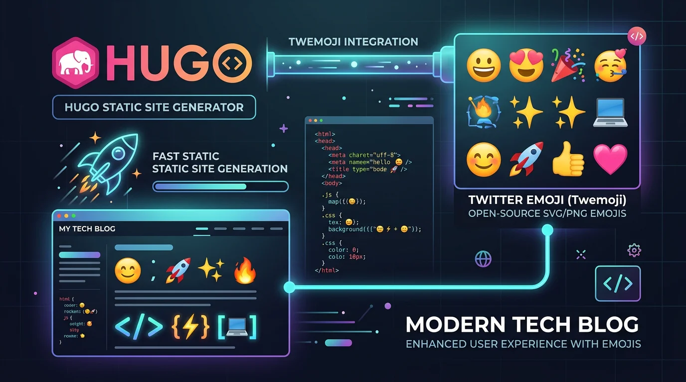

Website တွေနဲ့ Blog တွေ ရေးသားတဲ့အခါ Emoji တွေကို စာသားထဲမှာ ထည့်သုံးလေ့ ရှိကြပါတယ်။ ဒါပေမဲ့ Windows, macOS, Linux နဲ့ Android စတဲ့ Operating System တွေအလိုက် Emoji ပုံစံ မတူတာမျိုး ဒါမှမဟုတ် Linux လို System တွေမှာ Emoji မပေါ်တာမျိုး မဖြစ်ရအောင် Twitter ရဲ့ Open-Source Emoji ဖြစ်တဲ့ **Twemoji** ကို အသုံးပြုကြတာ ဖြစ်ပါတယ်။

၂၀၂၁ ခုနှစ်လောက်တုန်းက ကျွန်တော် Hugo မှာ Twemoji ထည့်ဖို့အတွက် `hugo-mod-twemoji` ဆိုတဲ့ Hugo Go Module နည်းလမ်းကို သုံးပြီး Note တစ်ခု ရေးခဲ့ဖူးပါတယ်။ ဒါပေမဲ့ အခု ၂၀၂၆ ခုနှစ်မှာတော့ အဲဒီ Module နည်းလမ်းက Out of Date ဖြစ်သွားပြီး Hugo Website တွေအတွက် ပိုမိုပေါ့ပါး၊ ပိုမိုမြန်ဆန်တဲ့ ခေတ်သစ် နည်းလမ်းတွေ ရှိလာပါပြီ။

ဒီဆောင်းပါးမှာတော့ အရင် Hugo Module နည်းလမ်း ဘာကြောင့် မသုံးသင့်တော့တာလဲဆိုတဲ့ အချက်နဲ့ Hugo Website မှာ Twemoji ကို ပေါ့ပေါ့ပါးပါး ထည့်သွင်း အသုံးပြုနည်းကို လက်တွေ့ မျှဝေပေးသွားပါမယ်။



---

## ၁။ အရင် Hugo Module နည်းလမ်း ဘာကြောင့် အဆင်မပြေတော့တာလဲ

အရင်တုန်းက Hugo ရဲ့ `config.toml` ထဲမှာ Go Module Import သုံးပြီး Twemoji ကို ဆွဲယူခဲ့ကြပါတယ်။ ဒါပေမဲ့ အခုအခါမှာတော့-

1. **Twitter ရဲ့ မူရင်း Repository Archive ဖြစ်သွားခြင်း:** Twitter/X က မူရင်း `twitter/twemoji` repository ကို Archive လုပ်လိုက်တဲ့အတွက် တရားဝင် Update တွေ ရပ်တန့်သွားပါတယ်။ လက်ရှိမှာတော့ Open Source Community က [jdecked/twemoji](https://github.com/jdecked/twemoji) အနေနဲ့ ဆက်လက် ထိန်းသိမ်း မွမ်းမံပေးနေတာ ဖြစ်ပါတယ်။
2. **Build Time နှေးကွေးပြီး ဖိုင်အရွယ်အစား ကြီးမားခြင်း:** Hugo Module နဲ့ ဆွဲယူတဲ့အခါ မလိုအပ်ဘဲ SVG ဖိုင်ပေါင်း ၄,၀၀၀ ကျော်ကို Go Cache ထဲ ဒေါင်းလုဒ် ဆွဲချရတဲ့အတွက် CI/CD Deployment နဲ့ Build Time တွေကို တော်တော်လေး နှေးကွေးစေပါတယ်။
3. **Go Dependency လိုအပ်ခြင်း:** Hugo Module သုံးဖို့အတွက် Server/Host ပေါ်မှာ Go (Golang) ကို မဖြစ်မနေ Install လုပ်ထားပေးရပါတယ်။

ဒါကြောင့် အခုခေတ်မှာ Hugo Module တွေ၊ `go.mod` တွေနဲ့ ရှုပ်ရှုပ်ထွေးထွေး မလုပ်တော့ဘဲ **Client-Side Lightweight Script (သို့မဟုတ်) Curated Static SVGs** နည်းလမ်းကို ပြောင်းလဲ အသုံးပြုကြတာ ဖြစ်ပါတယ်။

---

## ၂။ Modern Twemoji ချိတ်ဆက်နည်း (၃ ဆင့်)

ခေတ်သစ် နည်းလမ်းအရ Hugo ရဲ့ `config.toml` ထဲမှာ Module တွေ ထည့်စရာ မလိုတော့ပါဘူး။ အောက်ပါ အဆင့် ၃ ဆင့်အတိုင်း အလွယ်တကူ ပြုလုပ်နိုင်ပါတယ်။

### အဆင့် (၁) - Twemoji Partial Template ပြုလုပ်ခြင်း

ပထမဆုံး `layouts/_partials/twemoji.html` ဆိုတဲ့ ဖိုင်လေးတစ်ခု ဆောက်ပြီး အောက်ပါ Script ကို ထည့်ပေးလိုက်ပါ-

```html
{{ with resources.Get "twemoji/twemoji.min.js" }}
  {{ with resources.Fingerprint . }}
    <script>
      (function () {
        var loadTwemoji = function () {
          var script = document.createElement("script");
          script.src = "{{ .RelPermalink }}";
          script.integrity = "{{ .Data.Integrity }}";
          script.crossOrigin = "anonymous";
          script.onload = function () {
            if (window.twemoji) {
              window.twemoji.parse(document.querySelector("main") || document.body, {
                base: "https://cdn.jsdelivr.net/gh/jdecked/twemoji@latest/assets/",
                folder: "svg",
                ext: ".svg",
              });
            }
          };
          document.head.appendChild(script);
        };

        // Core Web Vitals မထိခိုက်စေရန် Idle အချိန်မှ Defer လုပ်ပြီး Run မည်
        if ("requestIdleCallback" in window) {
          window.requestIdleCallback(function () {
            setTimeout(loadTwemoji, 2000);
          }, { timeout: 4000 });
        } else {
          window.setTimeout(loadTwemoji, 3000);
        }
      })();
    </script>
  {{ end }}
{{ end }}
```

> **မှတ်ချက်:** `twemoji.min.js` ဖိုင်လေးကို `assets/twemoji/twemoji.min.js` ထဲမှာ ထည့်ထားပေးရုံပါပဲ။ SVG Assets တွေကိုတော့ Community က ထိန်းသိမ်းထားတဲ့ `jdecked/twemoji` CDN ကနေ On-demand ဆွဲယူသွားမှာ ဖြစ်ပါတယ်။

---

### အဆင့် (၂) - Base Template မှာ ချိတ်ဆက်ခြင်း

အထက်မှာ ရေးဆွဲခဲ့တဲ့ Partial ဖိုင်လေးကို ကိုယ့် Theme ရဲ့ `layouts/baseof.html` (သို့မဟုတ် `layouts/_default/baseof.html`) ဖိုင်ထဲက `</body>` Tag အပေါ်နားမှာ ထည့်သွင်းပေးလိုက်ပါ-

```html
    {{ partialCached "twemoji.html" . }}
  </body>
</html>
```

`partialCached` ကို သုံးထားတဲ့အတွက် Page တိုင်းအတွက် Hugo က အကြိမ်ကြိမ် Re-render မလုပ်ဘဲ Cache သုံးသွားမှာမို့ Build Speed ကို ပိုမို မြန်ဆန်စေပါတယ်။

---

### အဆင့် (၃) - CSS Style သတ်မှတ်ခြင်း

Twemoji Script က စာသားထဲက Emoji တွေကို `` Tag အဖြစ် အလိုအလျောက် ပြောင်းလဲပေးသွားတာ ဖြစ်ပါတယ်။ စာသားတွေနဲ့ တစ်ညီတည်း လှပနေစေဖို့ `assets/css/main.css` ထဲမှာ အောက်ပါ CSS လေး ထည့်ပေးရပါမယ်-

```css
img.emoji {
  display: inline;
  height: 1em;
  width: 1em;
  margin: 0 0.05em 0 0.1em;
  vertical-align: -0.1em;
}
```

ဒီ Styling ထည့်လိုက်ရင် စာလုံး Size ကြီးရင် ကြီးသလို (`1em`) Emoji အရွယ်အစားက စာသား Line Height နဲ့ အချိုးကျ လိုက်ပြောင်းပေးသွားမှာ ဖြစ်ပါတယ်။

---

## ၃။ Performance & Core Web Vitals မထိခိုက်အောင် ဂရုစိုက်နည်း

Emoji တွေ Render လုပ်တာက စာဖတ်သူရဲ့ Browser ပေါ်မှာ Script Run ပြီး အလုပ်လုပ်ရတာ ဖြစ်ပါတယ်။

ဒါကြောင့် Page စဖွင့်ဖွင့်ချင်းမှာ တင်ပြရတဲ့ **Largest Contentful Paint (LCP)** နဲ့ **First Contentful Paint (FCP)** တွေကို Script က လာမနှောင့်ယှက်နိုင်အောင် ကျွန်တော်တို့ အပေါ်က ကုဒ်မှာ `requestIdleCallback` ကို သုံးပြီး Browser အားလပ်ချိန်မှသာ Twemoji ကို အလုပ်လုပ်ခိုင်းထားတာ ဖြစ်ပါတယ်။

ဒီလို ရေးသားလိုက်တဲ့အခါ-
- Google Lighthouse Score ၁၀၀ အပြည့် ရရှိစေပါတယ်။
- Hugo Build Time က စက္ကန့်ပိုင်းအတွင်း ပြီးစီးပါတယ်။
- Go Modules သွင်းစရာ မလိုတော့တဲ့အတွက် `config.toml` လည်း သန့်ရှင်းသွားပါတယ်။

---

## ၄။ နမူနာ Emoji စမ်းသပ်ချက်များ (Twemoji Live Preview)

ဒီဆောင်းပါးထဲမှာ Twemoji Script ရဲ့ အလုပ်လုပ်ပုံကို တိုက်ရိုက် စမ်းသပ် ကြည့်ရှုနိုင်ဖို့ နမူနာ Emoji လေးတွေကို အမျိုးအစားအလိုက် စုစည်း ထည့်သွင်းပေးထားပါတယ်-

### ရေပန်းစားတဲ့ အီမိုဂျီများ (Popular & Reactions)
😀 😃 😄 😁 😆 😅 🤣 😂 🙂 🙃 😉 😊 😇 🥰 😍 🤩 😘 😗 😚 😋 😛 😜 🤪 😝 🤑 🤗 🤭 🤫 🤔 🤐 🤨 😐 😑 😶 😏 😒 🙄 😬 🤥 😌 😔 😪 🤤 😴 😷 🤒 🤕 🤢 🤮 🤧 🥵 🥶 🥴 😵 🤯 🤠 🥳 🥸 😎 🤓 🧐

### Developer & Tech Emojis
💻 🖥️ 📱 ⌨️ 🖱️ 🖨️ 🕹️ 💾 💿 📀 📼 📷 📹 🎥 📽️ 📡 🔋 🔌 💡 🔦 🕯️ 🧯 🗑️ 🛢️ 💸 💵 💴 💶 💷 🪙 💰 💳 💎 ⚖️ 🪜 🧰 🪛 🔧 🔨 ⚒️ 🛠️ ⛏️ 🪚 🔩 ⚙️ 🪤 🧱 ⛓️ 🧲 🔫 💣 🧨 🪓 🔪 🗡️ ⚔️ 🛡️ 🚬 ⚰️ 🪦 ⚱️ 🏺 🔮 📿 🧿 💈 ⚗️ 🔭 🔬 🕳️ 🩹 🩺 💊 💉 🩸 🧬 🦠 🧫 🧪 🚀 🛰️ 🛸 ⚡ 🌐 ✨ 🎉 🔥 🎯 📌 ☕

### လက်ဟန်ခြေဟန် အီမိုဂျီများ (Gestures & People)
👋 🤚 🖐️ ✋ 🖖 🫱 🫲 🫳 🫴 🫷 🫸 👌 🤌 🤏 ✌️ 🤞 🫰 🤟 🤘 🤙 👈 👉 👆 🖕 👇 ☝️ 🫵 👍 👎 ✊ 👊 🤛 🤜 👏 🙌 🫶 👐 🤲 🤝 🙏 ✍️ 💅 🤳 💪 🦾 🦿 🦵 🦶 👂 🦻 👃 🫀 🫁 🧠 🦷 🦴 👀 👁️ 👅 👄 🫦 💋 🩸

### သဘာဝနဲ့ တိရစ္ဆာန်များ (Nature & Animals)
🐶 🐱 🐭 🐹 🐰 🦊 🐻 🐼 🐻‍❄️ 🐨 🐯 🦁 🐮 🐷 🐽 🐸 🐵 🙈 🙉 🙊 🐒 🐔 🐧 🐦 🐤 🐣 🐥 🦆 🦅 🦉 🦇 🐺 🐗 🐴 🦄 🐝 🪱 🐛 🦋 🐌 🐞 🐜 🪰 🪲 🪳 🦟 🦗 🕷️ 🕸️ 🦂 🐢 🐍 🦎 🦖 🦕 🐙 🦑 🦐 🦞 🦀 🐡 🐠 🐟 🐬 🐳 🐋 🦈 🐊 🐅 🐆 🦓 🦍 🦧 🦣 🐘 🦛 🦏 🐪 🐫 🦒 🦘 🦬 🐃 🐂 🐄 🐎 🐖 🐏 🐑 🦙 🐐 🦌 🐕 🐩 🦮 🐕‍🦺 🐈 🐈‍⬛ 🪶 🐓 🦃 🦤 🦚 🦜 🦢 🦩 🕊️ 🐇 🦝 🦨 🦡 🦫 🦦 🦥 🐁 🐀 🐿️ 🦔 🌸 🌺 🌻 🌹 🌷 🌼 🍀 🌿 🍁 🍂 🍃 🌍 🌕 ☀️ 🌙 ⭐ 🌟

စာဖတ်သူရဲ့ စက်ထဲမှာ Twemoji Script အလုပ်လုပ်တာနဲ့ အထက်ပါ Unicode စာလုံးလေးတွေ အားလုံးဟာ ကြည်လင်ပြတ်သားတဲ့ Twitter Standard SVG ပုံရိပ်လေးတွေအဖြစ် စာသားနဲ့ တစ်ပြေးညီ လှပစွာ ပြောင်းလဲသွားမှာ ဖြစ်ပါတယ်။

---

## ၅။ နိဂုံး

နည်းပညာတွေဟာ အချိန်နဲ့အမျှ ပြောင်းလဲနေတာဖြစ်လို့ အရင်နည်းလမ်းဟောင်းတွေ အဆင်မပြေတော့တဲ့အခါ ခေတ်နဲ့အညီ ပိုမိုပေါ့ပါးပြီး ထိရောက်တဲ့ Modern Approach တွေကို ပြောင်းလဲ အသုံးပြုသင့်ပါတယ်။

အခု မျှဝေပေးခဲ့တဲ့ နည်းလမ်းလေးက Hugo သုံးစွဲနေသူ မိတ်ဆွေတို့အတွက် မိမိ Website မှာ Emoji လှလှလေးတွေကို Performance ကောင်းကောင်းနဲ့ ထည့်သွင်းနိုင်ဖို့ အထောက်အကူ ဖြစ်မယ်လို့ မျှော်လင့်ပါတယ်။

