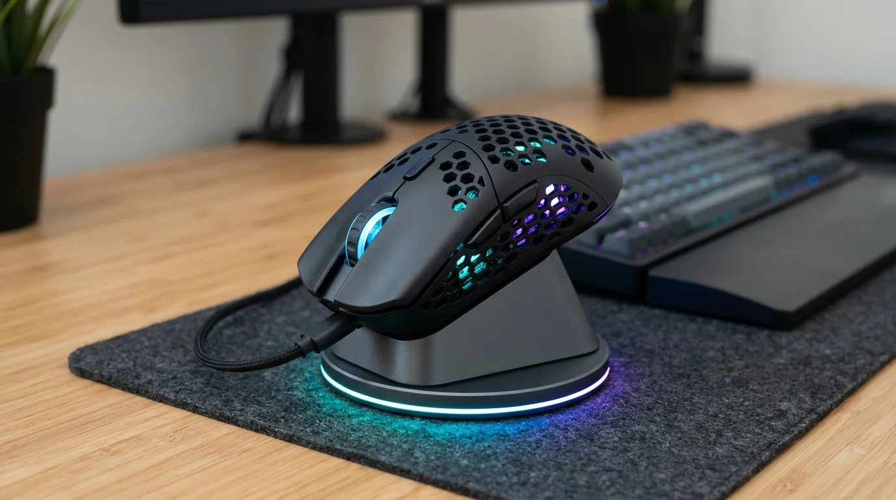

မကြာသေးခင်က ကျွန်တော့်ရဲ့ Desktop Setup မှာ ကြိုးရှုပ်တာတွေ သက်သာစေဖို့နဲ့ အားသွင်းရတာ လွယ်ကူစေဖို့အတွက် Charging Dock ပါတဲ့ Wireless Gaming Mouse တစ်လုံး ရှာဖြစ်ခဲ့ပါတယ်။ အဲဒီထဲကမှ ဈေးနှုန်းသင့်တင့်ပြီး Function စုံတဲ့ **HXSJ T90 3-Mode Wireless Gaming Mouse** ကို ပထမဆုံးအကြိမ် ဝယ်ယူပြီး စမ်းသပ်သုံးစွဲဖြစ်ခဲ့ပါတယ်။

ပစ္စည်းအသစ်ရောက်လာပြီး စသုံးတဲ့အခါ ပုံမှန် Mouse တွေနဲ့မတူဘဲ နာမည်အထင်မှားတာနဲ့ Bluetooth ချိတ်ဆက်တဲ့နေရာမှာ စတင်သုံးစွဲသူတွေ အမှတ်တမဲ့ ကြုံရတတ်တဲ့ ပြဿနာလေးတွေ ရှိပါတယ်။ ဒီဆောင်းပါးမှာတော့ HXSJ T90 ကို ပထမဆုံး စတင်ဝယ်ယူသုံးစွဲသူတစ်ယောက်အနေနဲ့ ရရှိခဲ့တဲ့ အတွေ့အကြုံ၊ First Impressions တွေနဲ့ Bluetooth ချိတ်မရတဲ့ ပြဿနာကို ဘယ်လို အလွယ်တကူ ဖြေရှင်းရမလဲဆိုတာ မျှဝေပေးသွားပါမယ်။

---

## ၁။ ဘူးခွံပေါ်က RoHS အမှတ်အသားနဲ့ နာမည် အထင်မှားမှု

အွန်လိုင်းကနေ ပစ္စည်းမှာယူပြီး ဘူးခွံ ဒါမှမဟုတ် Mouse အောက်ခြေက စတစ်ကာကို ကြည့်လိုက်တဲ့အခါ စာလုံးကြီးကြီးနဲ့ `RoHS`၊ `CE`၊ `FCC` ဆိုပြီး ရေးထားတာကို အရင်ဆုံး တွေ့ရတတ်ပါတယ်။

ဒါကြောင့် အသုံးပြုသူတချို့က ဒီ Mouse ရဲ့ Brand နာမည်ကို `RoHS T90` လို့ အမှတ်မှားပြီး ရှာဖွေတတ်ကြပါတယ်။ တကယ်တော့ **RoHS (Restriction of Hazardous Substances)** ဆိုတာ လူကို အန္တရာယ်ဖြစ်စေတဲ့ ဓာတုပစ္စည်းတွေ မပါဝင်ကြောင်း အသိအမှတ်ပြုတဲ့ ဥရောပစံချိန်စံညွှန်း အမှတ်အသားသာ ဖြစ်ပါတယ်။

Mouse ရဲ့ ထုတ်လုပ်သူ Brand အစစ်အမှန်က **HXSJ** ဖြစ်ပြီး Model ကတော့ **T90** ဖြစ်ပါတယ်။ Driver ရှာတာဖြစ်စေ၊ အချက်အလက် ရှာဖွေတာဖြစ်စေ `HXSJ T90` ဆိုတဲ့ နာမည်နဲ့ ရှာမှသာ တိကျတဲ့ အချက်အလက်တွေကို ရရှိမှာ ဖြစ်ပါတယ်။

---

## ၂။ Bluetooth စာရင်းထဲမှာ ဘာကြောင့် ပေါ်မလာတာလဲ

HXSJ T90 ကို စတင်သုံးစွဲသူတွေ အများဆုံး တွေ့ရတဲ့ အခက်အခဲကတော့ Mouse အောက်ခြေက Power ခလုတ်ကို ဖွင့်ထားပေမဲ့ ကွန်ပျူတာ (သို့မဟုတ် ဖုန်း) ရဲ့ Bluetooth Search ထဲမှာ စက်နာမည် ပေါ်မလာတာ ဖြစ်ပါတယ်။

ဒါ့အပြင် ဒီ Mouse မှာ သီးသန့်ရွှေ့ရတဲ့ Bluetooth Slide Switch မပါဝင်ဘဲ ခလုတ်အလုံးလေး (Mode Button) တစ်ခုတည်းသာ ပါဝင်တာကြောင့် ဘယ်လို ချိတ်ရမှန်း မသိဘဲ ဖြစ်တတ်ပါတယ်။

### အဓိက အကြောင်းရင်း

Mouse တွေမှာ Battery သက်တမ်း ကြာရှည်ခံစေဖို့အတွက် Bluetooth Signal ကို အမြဲတမ်း Broadcast မလွှင့်ထားပါဘူး။ ပုံမှန်အတိုင်း ဖွင့်ထားရုံသက်သက်ဆိုရင် Mouse ဟာ အရင်က ချိတ်ဆက်ဖူးတဲ့ စက်ဆီကိုပဲ အလိုအလျောက် ပြန်ချိတ်ဖို့ ကြိုးစားနေတာ ဖြစ်ပါတယ်။

စက်အသစ်တစ်ခုနဲ့ ပထမဆုံးအကြိမ် ချိတ်ဆက်ဖို့အတွက် Mouse ကို **Pairing Mode (ရှာဖွေတွေ့ရှိနိုင်တဲ့ အခြေအနေ)** ထဲ အရင်ဆုံး ရောက်အောင် ခလုတ်နဲ့ အမိန့်ပေးဖို့ လိုအပ်ပါတယ်။

### Bluetooth အောင်မြင်စွာ ချိတ်ဆက်နည်း (Step-by-Step)

HXSJ T90 ရဲ့ အောက်ခြေမှာ Power Switch (ON/OFF) နဲ့ Mode Button ဆိုပြီး ခလုတ်နှစ်မျိုးသာ ပါဝင်ပါတယ်။ Mode ခလုတ်ကို တစ်ချက်ချင်း နှိပ်လိုက်တာနဲ့ အချက်ပြမီး အရောင်ပြောင်းပြီး Mode တွေကို ပြောင်းလဲပေးပါတယ်-
* **မီးနီ (Red):** 2.4GHz Wireless Mode (USB Dongle နဲ့ သုံးတဲ့ စနစ်)
* **မီးစိမ်း (Green):** Bluetooth Channel 1 (BT1)
* **မီးပြာ (Blue):** Bluetooth Channel 2 (BT2)

Bluetooth ချိတ်ဆက်ဖို့ အဆင့်တွေကတော့-

1. **Power ဖွင့်ပါ:** Mouse အောက်ခြေက Power Switch ကို `ON` အနေအထားဆီ ရွှေ့ပေးပါ။
2. **Bluetooth Mode ကို ရွေးပါ:** အောက်ခြေက Mode Button လေးကို တစ်ချက်ချင်း နှိပ်ပြီး ကိုယ်ချိတ်ချင်တဲ့ လိုင်း (BT1 မီးစိမ်း သို့မဟုတ် BT2 မီးပြာ) ရောက်အောင် ရွေးပေးပါ။
3. **Mode Button ကို ဖိထားပါ (Long Press):** ရွေးထားတဲ့ Bluetooth Mode မှာ Mode Button လေးကို အချက်ပြ LED မီး မြန်မြန်မှိတ်တုတ်မှိတ်တုတ် ဖြစ်လာတဲ့အထိ **၃ စက္ကန့်ကနေ ၅ စက္ကန့်ခန့်** ဖိထားပေးပါ။ မီးမြန်မြန် လင်းလာပြီဆိုရင် Pairing Mode ထဲ ရောက်သွားပါပြီ။
4. **စက်ထဲက Bluetooth ရှာဖွေပါ:** ကွန်ပျူတာ (Windows / Linux / macOS) ဒါမှမဟုတ် ဖုန်းထဲက Bluetooth Settings ကို ဖွင့်ပြီး **Add Device** ကို နှိပ်ပါ။
5. **ချိတ်ဆက်ပါ:** စာရင်းထဲမှာ `BT5.0 Mouse` (ဒါမှမဟုတ် `BT3.0 Mouse` / `T90 Mouse`) ဆိုပြီး တွေ့ရတဲ့အခါ Click နှိပ်ပြီး Connect လုပ်လိုက်ရုံပါပဲ။

ချိတ်ဆက်ပြီးသွားတာနဲ့ အချက်ပြမီးငြိမ်သွားပြီး ချက်ချင်း စတင် အသုံးပြုနိုင်ပါပြီ။

---

## ၃။ HXSJ T90 ရဲ့ ပထမဆုံး အထင်ကြီးစရာ အချက်များ (First Impressions)

ဒီ Mouse ကို စတင်သုံးစွဲချိန်မှာ သတိထားမိတဲ့ အဓိက ထူးခြားချက်တွေကတော့ အောက်ပါအတိုင်း ဖြစ်ပါတယ်-

### က။ သီးသန့် Magnetic Charging Dock

ဒီ Mouse ရဲ့ အဓိက အားသာချက်ကတော့ စားပွဲတင် အားသွင်းခုံ (Charging Dock) ပါဝင်တာ ဖြစ်ပါတယ်။ ပုံမှန် Wireless Mouse တွေလို Battery အားကုန်တိုင်း ကြိုးလိုက်ရှာပြီး ထိုးနေစရာ မလိုပါဘူး။

* အလုပ်လုပ်ပြီးတာနဲ့ စားပွဲပေါ်က Dock ပေါ် Mouse ကို တင်ထားလိုက်ရုံနဲ့ သံလိုက်နဲ့ အံဝင်ခွင်ကျ ကပ်ပြီး အားသွင်းပေးပါတယ်။
* Dock ရဲ့ အောက်ခြေမှာလည်း လှပတဲ့ RGB Light Ring ပါဝင်တာကြောင့် Desktop Setup ကို ပိုပြီး ဆွဲဆောင်မှုရှိစေပါတယ်။

### ခ။ 3-Mode ချိတ်ဆက်မှု စနစ် (Tri-Mode Versatility)

ချိတ်ဆက်မှု Mode သုံးမျိုး စလုံး ပါဝင်တာကြောင့် နေရာစုံမှာ အဆင်ပြေပြေ သုံးနိုင်ပါတယ်-

| ချိတ်ဆက်မှု Mode | အသုံးပြုပုံ | အကြံပြုချက် |
| :--- | :--- | :--- |
| **2.4GHz Wireless** | USB Dongle ထိုးပြီး သုံးရတာ ဖြစ်ပါတယ်။ Latency အနည်းဆုံးမို့ Gaming ကစားဖို့ အကောင်းဆုံး ဖြစ်ပါတယ်။ | PC သို့မဟုတ် Gaming Laptop |
| **Bluetooth 5.0** | USB Port မလိုဘဲ တိုက်ရိုက် ချိတ်ဆက်နိုင်ပါတယ်။ Battery သုံးစွဲမှု သက်သာပါတယ်။ | ရုံးသုံး Laptop, Tablet, iPad |
| **Type-C Wired** | Type-C ကြိုးတိုက်ရိုက် ထိုးပြီး သုံးနိုင်ပါတယ်။ သုံးနေရင်း အားပါ တစ်ခါတည်း ဝင်ပါတယ်။ | Battery လုံးဝ ကုန်နေချိန် သို့မဟုတ် အရေးပေါ်အခြေအနေ |

### ဂ။ Honeycomb Shell Design နဲ့ အသုံးပြုရမှု

Mouse ရဲ့ အပေါ်ခွံနဲ့ ဘေးဘက်တွေကို အပေါက်ငယ်လေးတွေနဲ့ ဖွဲ့စည်းထားတဲ့ **Honeycomb (အုံဖွပ်ပုံစံ) Shell Design** နဲ့ ပြုလုပ်ထားပါတယ်။
* **ပေါ့ပါးမှု:** အလေးချိန်ကို သိသိသာသာ လျှော့ချပေးထားတာကြောင့် အချိန်အကြာကြီး Game ကစားတာ ဒါမှမဟုတ် ရုံးလုပ်ငန်းသုံးတဲ့အခါ လက်ညောင်းတာ သက်သာစေပါတယ်။
* **လေဝင်လေထွက်:** လက်ဖဝါး ချွေးထွက်တတ်သူတွေအတွက် လေဝင်လေထွက် ကောင်းမွန်စေပါတယ်။
* **RGB Visuals:** အပေါက်ငယ်လေးတွေရဲ့ အထဲဘက်ကနေ RGB မီးရောင်တွေ ဖြာထွက်နေပြီး Transparent Scroll Wheel နဲ့ ပေါင်းစပ်လိုက်တဲ့အခါ စားပွဲတင် Setup ကို ပိုပြီး ခေတ်မီတဲ့ Gaming Aesthetic ဖြစ်စေပါတယ်။

Click နှိပ်ရတဲ့ ခံစားချက်ကလည်း တုံ့ပြန်မှု မြန်ဆန်ပြီး အပေါ်ဘက်မှာ DPI ခလုတ် ပါဝင်တာကြောင့် Cursor အမြန်နှုန်းကို လိုအပ်သလို ချက်ချင်း ပြောင်းလဲနိုင်ပါတယ်။

---

## ၄။ အားသာချက်နဲ့ သတိပြုစရာ အချက်များ

| အားသာချက်များ (Pros) | သတိပြုစရာ အချက်များ (Cons) |
| :--- | :--- |
| အားသွင်းရ လွယ်ကူစေတဲ့ Magnetic Dock ပါဝင်ခြင်း | Bluetooth အတွက် သီးသန့် Slide Switch မပါဘဲ Mode Button ကို Long Press နှိပ်ရခြင်း |
| 2.4G, Bluetooth, Type-C သုံးမျိုးစလုံး သုံးနိုင်ခြင်း | ပစ္စည်းဘူးခွံပေါ်က RoHS အမှတ်အသားကြောင့် Brand နာမည် အထင်မှားနိုင်ခြင်း |
| ပေါ့ပါးပြီး သက်တောင့်သက်သာရှိတဲ့ Ergonomic Design | အလွန်လက်ကြီးသူတွေအတွက် Size အနည်းငယ် သေးတယ်လို့ ခံစားရနိုင်ခြင်း |
| စားပွဲပေါ်မှာ ကြိုးရှုပ်ထွေးမှု လုံးဝ သက်သာစေခြင်း | RGB မီး အမြဲဖွင့်ထားရင် Battery ကုန်နှုန်း ပိုမြန်နိုင်ခြင်း |

---

## နိဂုံးချုပ် သုံးသပ်ချက်

ခြုံပြီး ပြောရရင် **HXSJ T90 3-Mode Gaming Mouse** ဟာ ဈေးနှုန်းသင့်တင့်ပြီး Charging Dock ပါဝင်တဲ့ Wireless Mouse ရှာနေသူတွေအတွက် အတော်လေး တန်ဖိုးရှိတဲ့ Gadget တစ်ခု ဖြစ်ပါတယ်။

ပထမဆုံး ဝယ်ယူချိန်မှာ Bluetooth မတွေ့တဲ့ ပြဿနာလေး ကြုံရနိုင်ပေမဲ့ အထက်မှာ ရှင်းပြခဲ့တဲ့အတိုင်း Pairing Mode ဝင်ပြီး ချိတ်လိုက်ရင် ဘာပြဿနာမှ မရှိဘဲ ချောချောမောမော သုံးနိုင်မှာ ဖြစ်ပါတယ်။ စားပွဲတင် Desktop Setup မှာ ကြိုးမဲ့သပ်ရပ်မှုကို လိုချင်သူတွေ စမ်းသပ်သုံးစွဲကြည့်ဖို့ အကြံပြုချင်ပါတယ်။
