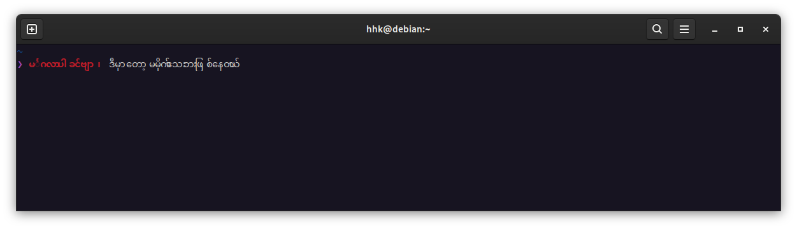
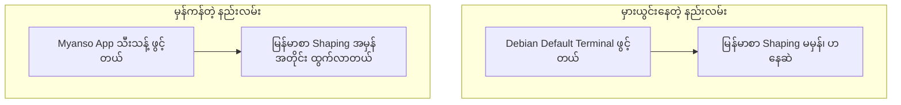
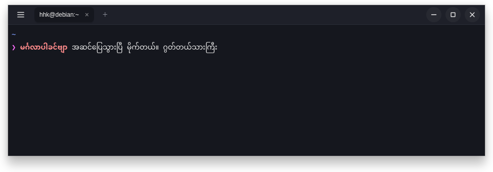

Linux ပေါ်မှာ Terminal နဲ့ အလုပ်လုပ်တဲ့အခါ၊ အထူးသဖြင့် AI CLI tool တွေဖြစ်တဲ့ Google Antigravity (`agy`), Claude Code, Codex CLI စတာတွေကို Terminal ကနေတစ်ဆင့် ခိုင်းစေတဲ့အခါ မြန်မာစာ မမှန်တာ၊ ဗျည်းနဲ့ သရတွေ တစ်ခုစီ ပြတ်ထွက်နေတာ (Shaping ပျက်တာ) ကြုံဖူးကြမှာပါ။

ဒီပြဿနာကို ပြေလည်စေဖို့ ကို Saturngod ရေးသားထားတဲ့ Myanmar Character Focus Terminal ဖြစ်တဲ့ **[Myanso](https://github.com/saturngod/myanso)** ကို Install လုပ်ပြီး စမ်းသပ်ဖြစ်ခဲ့ပါတယ်။ ဒါပေမဲ့ သွင်းပြီးစမှာ ချက်ချင်း အဆင်မပြေသေးတာတွေ၊ Zsh ထဲမှာ စာရိုက်တဲ့အခါ `<103a><1039>` ဆိုပြီး Hex Code တွေ ပေါ်လာတဲ့ ပြဿနာတွေကို တွေ့ခဲ့ရပါတယ်။ ဒီဆောင်းပါးမှာတော့ ဒီပြဿနာတွေ ဘာကြောင့်ဖြစ်တာလဲဆိုတဲ့ အရင်းအမြစ်နဲ့ အဆင့်ဆင့် အဆင်ပြေအောင် ဖြေရှင်းခဲ့တဲ့ နည်းလမ်းတွေကို မျှဝေပေးလိုက်ပါတယ်။


---

## ၁။ Stock Terminal တွေမှာ မြန်မာစာ ဘာကြောင့် မမှန်တာလဲ

Linux မှာ ပါဝင်တဲ့ GNOME Terminal (VTE engine) ဒါမှမဟုတ် စံထားသုံးကြတဲ့ `xterm.js` အခြေခံ terminal တွေဟာ **Monospace Grid** ပေါ်မှာ အလုပ်လုပ်ကြပါတယ်။ 

Monospace စနစ်မှာ စာလုံးတစ်လုံးစီအတွက် ကွက်လပ် (cell) တစ်ခုစီ ပေးထားပြီး cell တစ်ခုချင်းစီကို သီးသန့် `letter-spacing` တွေ ထည့်သွင်းထားပါတယ်။ အင်္ဂလိပ်စာလို အက္ခရာမျိုးအတွက် အဆင်ပြေပေမဲ့ မြန်မာစာလို Complex Script တွေမှာတော့-
* ဗျည်း (Base)
* ဗျည်းတွဲ (Medials - ◌ျ ◌ြ ◌ွ ◌ှ)
* အသတ် (Asat - ◌်)
* အပေါ်အောက်သရများ (Vowels - ◌ိ ◌ု ◌ာ)

စတဲ့ အစိတ်အပိုင်းအားလုံးဟာ **Grapheme Cluster** တစ်ခုတည်းအဖြစ် ပေါင်းစပ်မှသာ Font က စာလုံးအပြည့်အစုံကို လှလှပပ ပုံဖော် (Shape) ပေးနိုင်တာပါ။ Monospace terminal တွေက အဲဒီ cluster ကြီးကို cell အပိုင်းအစတွေ ခွဲထုတ်လိုက်တဲ့အတွက် `မြန်မာ` လို့ မထွက်လာတော့ဘဲ `မ ြ န ် မ ာ` ဆိုပြီး စာလုံးတွေ ပြတ်ထွက်ကုန်ပါတယ်။

### Myanso က ဒါကို ဘယ်လို ဖြေရှင်းထားလဲ

Myanso က Electron + xterm.js 6 ပေါ်မှာ အခြေခံထားပြီး Renderer အဆင့်မှာ သီးသန့် Patch ထည့်ပေးထားပါတယ်-
1. **DOM Span Collapse (Shaping Fix):** Cell run တစ်ခုတည်းမှာရှိတဲ့ ပုံစံတူ cell တွေကို `<span>` တစ်ခုတည်းအဖြစ် ပေါင်းစည်းပေးလိုက်ပါတယ်။ အဲဒီအခါ Browser ရဲ့ text shaping engine က မြန်မာစာလုံးတွဲတစ်ခုလုံးကို စနစ်တကျ ပုံဖော်ပေးသွားပါတယ်။
2. **Per-App Width Detection:** Terminal ထဲမှာ run နေတဲ့ foreground process ကိုလိုက်ပြီး width provider ကို အလိုအလျောက် ပြောင်းပေးပါတယ်-
   * `myan-shell`: zsh/bash shell အတွက် (marks တွေကို width 0 ယူဆ)
   * `myan-std`: vim, agy, iTerm2, Codex CLI စတာတွေအတွက် (Unicode Standard အတိုင်း)
   * `myan-allone`: Claude Code အတွက် (marks အားလုံးကို width 1 ယူဆ)

---

## ၂။ Debian / Linux ပေါ်မှာ Myanso ကို Install လုပ်ခြင်း

Myanso GitHub Repository ရဲ့ Releases စာမျက်နှာမှာ Linux အတွက် `.deb`, `.rpm` နဲ့ `AppImage` တွေ တင်ပေးထားပါတယ်။ ကျွန်တော်တို့ Debian / Ubuntu စနစ်တွေအတွက် `.deb` ကို အလွယ်တကူ သွင်းယူနိုင်ပါတယ်။

Terminal ကိုဖွင့်ပြီး အောက်ပါ Command တွေနဲ့ ဒေါင်းလုဒ်ဆွဲကာ သွင်းနိုင်ပါတယ်-

```bash
# Latest deb package ကို download ဆွဲပါမယ် (x86_64 architecture အတွက်)
curl -LO https://github.com/saturngod/myanso/releases/download/v0.5.0/myanso_0.5.0_amd64.deb

# apt-get နဲ့ install လုပ်ပါမယ် (dependencies တွေပါ တစ်ခါတည်း ရှင်းပေးပါတယ်)
sudo apt-get install -y ./myanso_0.5.0_amd64.deb

# ဒေါင်းထားတဲ့ deb ဖိုင် အပိုကို ရှင်းထုတ်နိုင်ပါတယ်
rm myanso_0.5.0_amd64.deb
```

သွင်းပြီးသွားတဲ့အခါ Binary ကို `/usr/bin/myanso` မှာ ချိတ်ပေးထားပြီး Desktop Application Menu ထဲမှာလည်း **Myanso** ဆိုပြီး အသင့်ပေါ်နေမှာ ဖြစ်ပါတယ်။

---

## ၃။ အဖြစ်များတဲ့ အထင်မှားမှု (Common Confusion)

Myanso ကို Install လုပ်ပြီးသွားတဲ့အခါ လူတော်တော်များများ ချက်ချင်း မေးတတ်ကြတာက-

> *"ကျွန်တော် Myanso သွင်းပြီးသွားပြီ၊ ဒါပေမဲ့ လက်ရှိသုံးနေတဲ့ Terminal ထဲမှာ agy ခေါ်သုံးတော့လည်း မြန်မာစာက ပုံမှန်အတိုင်း ပျက်နေတုန်းပဲ၊ ဘာလုပ်ရမလဲ"*

ဒီနေရာမှာ သတိပြုရမှာက **Myanso ဆိုတာ Standalone Desktop Terminal App တစ်ခု** ဖြစ်ပါတယ်။ လက်ရှိ သုံးနေတဲ့ Debian ရဲ့ Default Terminal (GNOME Console) ထဲကို လာရောက် Patch လုပ်ပေးတဲ့ Plugin မဟုတ်ပါဘူး။



အပေါ်က ပုံမှာ မြင်ရတဲ့အတိုင်း Debian ရဲ့ Default Terminal မှာ `မင်္ဂလာပါ ခင်ဗျာ ၊ ဒီမှာတော့ မမိုက်သလားဖြ စ်နေတယ်` လို့ ရိုက်စမ်းကြည့်တဲ့အခါ Zsh မှာ စာလုံးပျက်တာကို ဖြေရှင်းထားရင်တောင် Terminal ရဲ့ Monospace VTE engine ကြောင့် စာလုံးတွေက အံမဝင်ဘဲ `ဖြ စ်နေတယ်` ဆိုပြီး အသတ်နဲ့ ဗျည်းတွေ ဟနေတာ၊ စာလုံးပြတ်နေတာကို တွေ့ရမှာပါ။



ဒါကြောင့် မြန်မာစာ ကောင်းကောင်းမြင်ချင်ရင် လက်ရှိ Default Terminal အဟောင်းထဲမှာ သုံးမယ့်အစား **Myanso Terminal window အသစ်ကို ဖွင့်ပြီး အဲဒီထဲမှာ စတင် run ရမှာ ဖြစ်ပါတယ်။**

```bash
# Terminal ကနေဖြစ်စေ၊ Application menu ကနေဖြစ်စေ Myanso ကို ဖွင့်ပါ
myanso &
```

---

## ၄။ Zsh ထဲမှာ `<103a><1039>` စာလုံးပျက် ပေါ်လာတဲ့ လျှို့ဝှက်ချက်

Myanso ကို ဖွင့်ပြီးတဲ့နောက် စာရိုက်စမ်းကြည့်တဲ့အခါ နောက်ထပ် ထူးဆန်းတဲ့ ပြဿနာတစ်ခု ထပ်တွေ့ရပါတယ်-

```text
❯ မင<103a><1039>ဂလပါ
```

`မင်္ဂလာပါ` လို့ ရိုက်လိုက်ပေမဲ့ အလယ်က ကင်းစီး (င်္) စာလုံးတွေ ပျောက်သွားပြီး အဲဒီနေရာမှာ `<103a><1039>` ဆိုတဲ့ Angle Brackets တွေနဲ့ Hex code တွေ ထွက်လာတာပါ။

### အကြောင်းရင်း

Unicode စံနှုန်းအရ-
* `<103a>` = **U+103A** (အသတ် - Myanmar Sign Asat `်`)
* `<1039>` = **U+1039** (အောက်မြစ်/ဝိရမ - Myanmar Sign Virama `္`)

ကင်းစီးဖြစ်တဲ့ `င်္` ကို ရိုက်တဲ့အခါ `င` + `အသတ် (U+103A)` + `ဝိရမ (U+1039)` ဆိုပြီး တွဲစပ်ရပါတယ်။ ဒီနေရာမှာ အသတ်နဲ့ ဝိရမဟာ **Zero-width Combining Character** တွေ ဖြစ်ကြပါတယ်။

ပြဿနာက **Zsh (Z Shell)** ရဲ့ Line Editor (ZLE) မှာ ရှိနေတာပါ။ Zsh ရဲ့ မူလ Default Configuration မှာ `COMBINING_CHARS` ဆိုတဲ့ Option ကို ပိတ် (OFF) ထားတတ်ပါတယ်။ Zsh ရဲ့ လက်စွဲစာအုပ်မှာ ဒီလို ဖော်ပြထားပါတယ်-

> *"COMBINING_CHARS: Assume that the terminal displays combining characters correctly... If this option is not set, zero-width characters are displayed separately with special mark-up (typically `<xxxx>` where xxxx is the hex code)."*

ဆိုလိုတာက Zsh ဟာ Terminal တွေက combining character တွေကို ကောင်းကောင်း မပြသနိုင်ဘူးလို့ ကြိုတင်ယူဆထားပြီး Option ဖွင့်မထားရင် zero-width အက္ခရာတွေကို `<xxxx>` ဆိုတဲ့ hex markup အဖြစ် အလိုအလျောက် ပြောင်းပစ်လိုက်တာ ဖြစ်ပါတယ်။

### အမြစ်ပြတ် ဖြေရှင်းနည်း

ဒီပြဿနာကို ဖြေရှင်းဖို့အတွက် ကိုယ့်ရဲ့ `~/.zshrc` ဖိုင်ထဲမှာ `COMBINING_CHARS` option ကို ဖွင့်ပေးလိုက်ရုံပါပဲ-

```bash
echo '# Enable combining characters display in Zsh (fixes <103a><1039> hex codes)' >> ~/.zshrc
echo 'setopt COMBINING_CHARS' >> ~/.zshrc
```

ပြီးရင် ပြင်ဆင်ချက် အသက်ဝင်သွားအောင် reload လုပ်ပါမယ်-

```bash
source ~/.zshrc
```

အခုဆိုရင် Zsh က မြန်မာစာ Combining Character တွေကို hex code အဖြစ် မပြောင်းတော့ဘဲ ပုံမှန်စာလုံးအတိုင်း လက်ခံပေးသွားပါပြီ။

---

## ၅။ Noto Sans Myanmar Font စစ်ဆေးခြင်း

Myanso ဟာ မူလကတည်းက စနစ်ထဲမှာရှိတဲ့ `Noto Sans Myanmar` font ကို ဦးစားပေးအဖြစ် ထည့်သွင်းရှာဖွေပေးပါတယ်။ ကိုယ့်စက်ထဲမှာ Font ရှိမရှိ အောက်ပါ Command နဲ့ စစ်ကြည့်နိုင်ပါတယ်-

```bash
fc-list :lang=my
```

အကယ်၍ စက်ထဲမှာ Noto Myanmar Font မရှိသေးဘူးဆိုရင် Debian/Ubuntu မှာ အောက်ပါအတိုင်း အလွယ်တကူ သွင်းနိုင်ပါတယ်-

```bash
sudo apt install fonts-noto-core
```

---

## ၆။ လက်တွေ့ အသုံးပြုပုံ အဆင့်ဆင့်

အရာအားလုံး ပြင်ဆင်ပြီးသွားတဲ့အခါ အောက်ပါအဆင့်အတိုင်း အသုံးပြုနိုင်ပါပြီ-

1. **Myanso App ကို ဖွင့်ပါ** (GNOME Application Menu မှတစ်ဆင့် သို့မဟုတ် `myanso &` Command ဖြင့်)။
2. **Terminal Prompt မှာ agy ကို စတင် Run ပါ**:
   ```bash
   agy
   ```
3. Myanso က Foreground App ဟာ `agy` ဖြစ်နေတာကို အလိုအလျောက် ထောက်လှမ်းသိရှိပြီး မြန်မာစာ Unicode Width Standard (`myan-std`) ကို ချိန်ညှိပေးသွားပါမယ်။
4. `မင်္ဂလာပါ` စသဖြင့် မြန်မာလို စာရိုက်တဲ့အခါ စာလုံးတွေ မပြတ်တော့ဘဲ စာလုံးပေါင်းသတ်ပုံ အမှန်အတိုင်း ရှုမြင်အသုံးပြုနိုင်ပြီ ဖြစ်ပါတယ်။



အထက်ပါပုံမှာ မြင်တွေ့ရတဲ့အတိုင်း Myanso terminal window ထဲမှာ `မင်္ဂလာပါခင်ဗျာ အဆင်ပြေသွားပြီ မိုက်တယ်။ ဂွတ်တယ်သားကြီး` လို့ စာရိုက်လိုက်တဲ့အခါ စာလုံးအက္ခရာတွေ၊ ဗျည်းတွဲနဲ့ အသတ်တွေ အားလုံး ဟနေတာမျိုး မရှိတော့ဘဲ လုံးဝအဆင်ပြေပြေ ပုံဖော် (Shape) ပေးထားတာကို တွေ့ရပါမယ်။ agy လို AI coding assistant တွေနဲ့ Terminal ပေါ်ကနေ မြန်မာလို pair programming လုပ်တဲ့အခါမှာလည်း prompt စာကြောင်းတွေရော၊ ထွက်လာတဲ့ output တွေပါ ဖတ်ရလွယ်ကူပြီး မျက်စိရှင်းသွားစေမှာ ဖြစ်ပါတယ်။

---

## နိဂုံး (Takeaways)

Linux မှာ မြန်မာစာ Terminal ပြဿနာကို ဖြေရှင်းရာမှာ အဓိက သော့ချက် ၃ ချက် ရှိပါတယ်-
* **Terminal Emulator အဆင့်:** စာလုံးတွေ မပြတ်ထွက်ဘဲ ပေါင်းစည်းနိုင်ဖို့အတွက် Myanmar Shaping Patch ပါတဲ့ **Myanso** ကို အသုံးပြုခြင်း။
* **Shell အဆင့်:** Zsh ထဲမှာ `<103a><1039>` စတဲ့ hex code တွေ မပေါ်စေဖို့ `~/.zshrc` မှာ **`setopt COMBINING_CHARS`** ထည့်သွင်းခြင်း။
* **Font အဆင့်:** စံစနစ်နဲ့ အကိုက်ညီဆုံးဖြစ်တဲ့ **Noto Sans Myanmar** font ကို စနစ်ထဲမှာ ထည့်သွင်းထားခြင်း။

ဒီအချက် ၃ ချက် ပြည့်စုံသွားပြီဆိုရင်တော့ Linux Terminal ပေါ်မှာ Google Antigravity အပါအဝင် မည်သည့် AI CLI နဲ့မဆို မြန်မာစာကို အဆင်ပြေချောမွေ့စွာ တွဲဖက်အသုံးပြုနိုင်မှာ ဖြစ်ပါတယ်။
